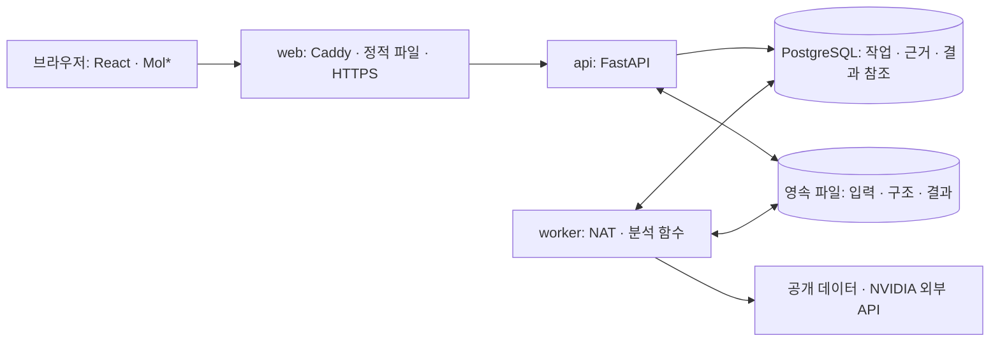

# ARCHITECTURE — HER2 항체 후보 검토 웹 서비스

작성일: 2026-09-25. 설계 초안. 2026-09-27 후속: 로컬 구현·격리 이미지 검증은 [실행 점검](frontend-hosting/runtime-audit.md)에 기록하며 공개 배포는 미검증이다. 아래 최초 설계와 현재 구현 차이를 구분한다.

후속 서비스 인터뷰로 공개 자료만 입력받고 개별 결과는 본인만 임시 조회·다운로드하는 범위가 정해졌다. 이 문서의 영속 저장·재조회·복구는 허용 보관 기간 안에서 적용하며, 만료 시에는 자료를 정리한다. 마지막 세션 연결 후 30분 유예는 [ADR-008](ADR.md)의 초기안으로 세부 구현 검토 전이다.

[INTENT](intent/INTENT.md)의 목적과 [PRD](PRD.md)의 요구사항을 구현할 구성과 책임을 정의한다. 기술 선택의 대안·근거는 [ADR](ADR.md), 과학적 판단 흐름은 [기존 설계](topics/her2/agent-design.md)에 둔다. 아래 연동 계약은 서비스 담당과 분석 담당이 함께 검토할 초안이며 기존 구현에서 확인한 규격이 아니다.

## 1. 구성 기준

| 영역 | 설계 기준 | 상태 |
|---|---|---|
| 웹 화면 | React + TypeScript + Vite, React Router, Mol* | 이번 설계에서 선택 |
| 웹 진입점 | Caddy: 정적 빌드 배포, HTTPS, API 역방향 프록시 | 이번 설계에서 선택 |
| API | Python + FastAPI: 입력 접수, 작업·결과·파일 조회 | 이번 설계에서 선택 |
| 분석 실행 | 별도 Python worker, 기존 Nemotron·NAT 설계를 연결 | 분리 방식 선택; 모델·NAT 호환성과 계정 접근 미검증 |
| 상태 저장 | PostgreSQL: 입력 메타데이터, 작업, 단계, 근거·결과 참조 | 이번 설계에서 선택 |
| 파일 저장 | 초기 단일 호스트의 영속 데이터 볼륨 | EC2 배치안에 종속된 잠정 선택 |
| 배포 | Docker Compose, 우선 AWS EC2 한 대와 EBS 검토 | Docker 확정; AWS·규격·리전은 잠정안 |

패키지·런타임 버전은 Mol*·NAT·분석 라이브러리의 동시 설치와 대표 입력 실행을 확인한 뒤 lockfile·이미지 버전으로 고정한다. 이 문서가 최신 버전 조합의 호환성을 보장하지 않는다.

## 2. 논리 구성

브라우저는 서비스 API만 호출하며 DB·worker·외부 모델의 자격 증명에 접근하지 않는다. 긴 예측 작업을 브라우저 연결이나 API 요청 수명에 묶지 않는다. 초기 worker는 한 번에 검토 작업 하나를 처리하도록 시작하고 동시 실행 확대는 계정 한도·메모리 측정 뒤 결정한다.

## 3. 화면과 분석의 책임

| 구성요소 | 책임 | 맡지 않는 일 |
|---|---|---|
| React 화면 | 입력·오류 안내, 작업 조회, 후보·조건 선택, 근거표·보고서, 다운로드 | 분석 지표 재계산, 임의 종합 점수 생성 |
| Mol* 연결부 | 구조 표시, 사슬·잔기 강조, 구조 조건 전환, 화면 선택 이벤트 연결 | 원자 좌표가 없는 위치 생성, 자체 생물학적 판정 |
| FastAPI | 입력 크기·형식 검증, 작업 접수·조회, 접근 제어, 파일 전달 | 긴 모델 호출과 전체 구조 분석을 HTTP 요청 안에서 완료 |
| worker | 자료 대응, 검증된 계산 함수 실행, 필요한 외부 호출, 근거와 결과 저장 | LLM 설명만으로 계산값·통과 판정 생성 |
| Nemotron·NAT | 허용된 작업 중 다음 단계 선택, 실행 연결·추적, 근거에 한정된 설명 | 입력 검증·실행 한도·보류 규칙 우회 |

Mol*는 결과 화면 진입 시 지연 로딩한다. 원자 데이터와 viewer 인스턴스는 React의 일반 상태에 복제하지 않고, React는 선택한 후보·조건·근거 ID를 관리한다. viewer 해제 시 구독과 그래픽 자원을 정리한다. 서버가 기록한 대응표·정렬 변환을 사용하여 표와 3D가 같은 잔기를 가리키게 한다.

현재 사용자 흐름은 [PRD 화면 구성](PRD.md#5-화면-구성)의 네 화면이다. 선택한 후보와 조건은 결과 식별자와 함께 관리하며, 결과를 다시 열 때 이전 후보의 표시가 남지 않도록 한다.

## 4. 실행 흐름과 판단 경계

1. API가 입력 형식과 필수 항목을 검증하고 입력 파일을 저장한다. 접수에 성공한 작업만 DB에 `queued`로 등록하고 작업 ID를 반환한다.
2. worker가 작업을 점유하고 원본을 보존한 채 후보·구간·사슬·잔기 대응을 만든다. 잘못된 후보는 해당 분석에서 제외하되 이유를 결과에 남긴다.
3. 기존 자료가 충분한지 확인한다. 충분하면 예측을 생략하고, 부족하면 설정된 한도 안에서 필요한 자료 조회·구조 예측을 수행한다.
4. 승인된 정의와 설정으로 접촉·표면 노출·충돌·신뢰도·자세 일관성을 계산한다. 당쇄·주변 구조 조건별로 자료의 존재와 누락을 함께 기록한다.
5. 구조화된 근거와 보류 규칙으로 의견을 만들고 설명을 연결한다. LLM 설명은 근거 ID·수치·의견의 범위를 검증한 뒤 저장한다. 설명 생성 실패는 계산 성공과 별도로 표시한다.
6. 파일 저장과 결과 참조의 일관성을 확인한 후 실행을 종료한다. 화면·보고서·JSON·CSV는 같은 결과 스냅샷을 읽는다.

과학적 판정 함수의 구체적 임계값은 [PRD Q05](PRD.md#8-미결정-항목과-결정-시점)가 해결되기 전 확정하지 않는다. 알려진 사실·계산 결과·미확인의 구분은 모든 단계에서 유지한다.

## 5. 작업 상태와 장애 처리

작업의 **실행 상태**와 후보·항목의 **검토 의견**을 별도 필드로 관리한다.

| 실행 상태 | 의미와 다음 처리 |
|---|---|
| `queued` | 접수·저장 완료, worker 대기 |
| `running` | worker 점유 후 단계 실행 중 |
| `completed` | 계획한 검토가 끝나고 결과 저장 완료. 과학적 보류 의견이 포함될 수 있음 |
| `partial` | 일부 결과는 있으나 실행 실패로 예정된 분석·보고 일부가 끝나지 않음 |
| `failed` | 유효한 검토 결과를 생성하지 못한 입력·실행 실패 |
| `interrupted` | worker 중단·생존 확인 만료 등으로 실행 완료 여부를 확인해야 함 |

`queued → running → completed / partial / failed`가 기본 전이다. 실행 중 worker를 잃으면 `interrupted`로 기록한다. 자료 부족으로 계획적으로 보류한 경우와 API 장애로 계산하지 못한 경우는 같은 상태로 뭉치지 않는다.

브라우저는 작업 ID로 상태를 주기적으로 조회한다. 조회 실패는 화면의 연결 상태로 표시하고 서버 작업을 실패로 바꾸지 않는다. 완료 시 조회를 멈추며 새로고침은 작업을 재접수하지 않는다.

작업 점유는 DB의 짧은 트랜잭션으로 처리하고 분석 동안 DB 잠금을 유지하지 않는다. 점유 식별자와 생존 시각을 저장하며, 결과 갱신은 현재 점유자만 허용한다. 중단된 작업을 자동 재실행하지 않고 기존 worker의 종료·점유 해제를 확인한 뒤 재처리한다. 따라서 exactly-once 외부 호출을 보장한다고 주장하지 않는다.

외부 요청 ID와 호출 단계를 기록한다. timeout 후 호출 성공 여부가 불명확하면 상태 조회 가능 여부부터 확인하며 비용이 드는 생성 호출을 무조건 반복하지 않는다. 확인된 실패의 재실행도 원본 실행을 덮어쓰지 않고 새 실행으로 연결한다. 재시도 수·대기·시간 상한은 Q06의 실측 결과로 정한다.

## 6. 데이터와 근거 연결

| 논리 개체 | 보존할 핵심 내용 |
|---|---|
| 검토 입력 | 표적·후보 ID, 서열·형식·분석 구간, 원본 파일 참조·해시, 입력 생성 시각 |
| 분석 실행 | 실행 ID, 입력 ID, 상태·현재 단계·오류, 설정·도구 버전, 외부 요청 ID, 시작·종료 시각 |
| 구조와 대응 | 구조 출처·종류·파일 해시, 모델·사슬·잔기 대응, 누락 구간, 분석한 assembly·정렬 범위·변환 |
| 구조 조건 | 후보 ID, HER2–항체 중심 / 확보한 주변 구조 포함, 사용한 구성요소·자료 공백, 조건의 근거 |
| 근거 항목 | 근거 ID, 종류, 후보·조건·구조 ID, 판단 항목, 값·단위·계산 정의, 참조 잔기, 출처·미확인 이유 |
| 검토 의견 | 적용 항목·범위, 검토 가능 / 추가 확인 / 보류, 근거 ID 목록, 충돌·한계·후속 질문 |
| 결과 스냅샷 | 실행 ID·schema version·생성 시각, 근거·의견, 구조·JSON·CSV 산출물 참조와 해시 |

잔기는 숫자 하나로 식별하지 않는다. 구조·모델·사슬의 author/label 식별자, 잔기 번호·삽입 코드와 원서열 위치의 대응을 보존한다. 실측값이 없는 항목은 `null`과 이유로 표현하며 0점으로 대체하지 않는다. 입력·실행·조건이 다르면 별도 근거로 유지한다.

파일은 임시 위치에 쓴 뒤 완성된 파일만 최종 경로로 이동하고 DB에 참조를 등록한다. 결과 완료 표시는 모든 필수 산출물 참조와 해시 확인 후 기록한다. 재시작 시 참조 없는 임시 파일·참조 대상 누락을 식별하고, 파일 누락 결과를 정상 다운로드로 제공하지 않는다.

## 7. 서비스와 분석의 연동 초안

| 경계 | 제안 계약 |
|---|---|
| 입력 접수 | `POST /api/reviews`: 후보·표적 메타데이터와 파일 접수, 검증 오류 또는 검토 ID 반환 |
| 분석 실행 | `POST /api/reviews/{id}/runs`: 동일 접수 키의 중복 요청은 같은 실행을 반환, 새 실행은 별도 ID 발급 |
| 상태 조회 | `GET /api/runs/{id}`: 실행 상태·단계·후보별 진행·오류·결과 존재 여부 |
| 결과 조회 | `GET /api/runs/{id}/result`: 저장된 결과 스냅샷, 미완료이면 그 상태 반환 |
| 파일 조회 | `GET /api/artifacts/{id}`: 접근 확인 후 해당 구조·JSON·CSV 제공, 임의 경로 접근 금지 |
| API → worker | 입력 ID·실행 ID·분석 설정 버전. worker는 같은 저장소에서 검증된 입력을 읽음 |
| worker → 결과 | 위 데이터 모델의 근거·의견·구조 참조·실행 상태를 구조화하여 저장 |

전체 JSON 스키마·필드 필수성·오류 코드는 두 담당 영역이 대표 정상·보류·실패 결과를 대조한 뒤 고정한다. 합의된 스키마를 바탕으로 FastAPI의 OpenAPI와 프런트엔드 타입을 맞추며 한쪽의 임시 mock을 최종 계약으로 취급하지 않는다.

후속 사용자 요청으로 [서비스 개발용 임시 계약 v0.1.0](frontend-hosting/temporary-contract.md)을 먼저 작성했다. 서비스 구현은 이 계약으로 시작하고 실제 로직 함수·공급자 응답은 adapter에서 변환한다. 최종 로직 합의를 기다리는 것을 화면·mock API·Docker 작업의 선행 조건으로 두지 않는다.

## 8. Docker와 AWS 배치안

초기 Compose 서비스는 `web`, `api`, `worker`, `db` 네 개다. `api`와 `worker`는 같은 Python 코드·이미지를 서로 다른 실행 명령으로 사용할 수 있다. `web`은 Node 빌드 단계에서 만든 정적 파일을 Caddy로 제공하며, Vite 개발 서버를 외부 서비스로 띄우지 않는다.

AWS를 채택하면 우선 단일 EC2에서 네 서비스를 운영하고 DB·산출물·TLS 데이터를 EBS에 대응하는 영속 볼륨에 둔다. 허용 보관 기간 내 컨테이너 교체 시 데이터가 유지되도록 하며 Docker 볼륨 자체를 백업으로 간주하지 않는다. 백업 대상으로 결정한 DB·산출물은 일관된 시점의 목록·해시와 별도 사본으로 복구를 검증한다. 임시 사용자 자료를 무조건 백업하지 않으며 백업 대상·위치·주기·만료와 복원 후 접근 정책은 Q02–Q03에서 확정한다.

초기에는 외부 호스팅 모델을 호출하는 구성이므로 EC2 GPU를 전제하지 않는다. 실제 NVIDIA 계정에서 필요한 호출을 할 수 없다면 이를 해결할 때까지 예측 경로는 미검증이며, 로컬 GPU 추론으로 자동 대체하지 않는다.

2026-09-25 후속 조사에서 기존 Nemotron 모델 페이지의 무료 엔드포인트가 Deprecated로 표시됨을 확인했다. Boltz-2의 시험용 API에는 입력 자료·이용 목적에 관한 조건도 있어 실제 제공자·공개 데모 경로를 Q06에서 검토한다. [확인 출처와 한계](frontend-hosting/hosting-requirements.md)

2026-09-25 사용자 확인에 따라 운영 기간은 해커톤 동안으로 제한한다. 서버는 에이전트 실행·도구 호출·구조 계산·API·DB를 맡고, 기존 설계의 모델 추론은 외부 API가 맡는다. 사용자의 서버 실행 언급을 Nemotron·Boltz-2 모델 자체를 EC2에 올리라는 결정으로 해석하지 않는다. NAT 자체는 기본적으로 GPU 없이 실행할 수 있지만 연결하는 모델·도구의 자원 요구는 별도다. [NAT 설치 안내](https://docs.nvidia.com/nemo/agent-toolkit/latest/quick-start/installing.html)

초기 부하 검증 후보는 **4 vCPU·16 GiB RAM의 x86 EC2 한 대**이며 `m7i.xlarge`를 예시로 둔다. API·worker·DB를 함께 실행하고 작업 하나를 처리하는 출발점으로 제안한 값이지 최소 요구량이나 충분함이 검증된 사양은 아니다. 대표 입력에서 CPU·최대 메모리·API 응답 지연을 측정하고, 자원 부족이 확인되면 8 vCPU·32 GiB급을 재검토한다. 외부 모델 응답 대기가 병목이면 EC2 증설로 해결된다고 보지 않는다. 규격 예시는 [AWS 공식 사양](https://docs.aws.amazon.com/ec2/latest/instancetypes/gp.html)을 2026-09-25에 확인했으며 리전별 가용성과 가격은 아직 산정하지 않았다.

2026-09-26 사용자 결정으로 서울 리전에서 약 한 달, 크레딧 차감 전 총 10만 원 이내로 준비한다. 위 `m7i.xlarge`는 종전 부하 검증 예시이며 이 예산의 상시 운영 규격으로 채택하지 않는다. 사용자가 4GB를 잠정 기준으로 채택했으며 `t3.medium`(2 vCPU·4 GiB)을 예산 내 검증 후보로 둔다. PR #19의 NAT 도구 실행과 별도 A-02·A-03 계산은 로컬 Linux arm64의 1GiB 제한에서 각각 최대 RSS 약 204/202MiB로 완료했다. 외부 모델 호출·실제 worker 통합·x86 EC2는 미검증이므로 활성 분석 1건 조건으로 최종 검증 후 규격을 확정한다. 부족하면 자동 증설하지 않고 운영 시간 축소나 배치 대안을 검토한다. [비용·준비 기준](frontend-hosting/backend-deployment-plan.md#10-서울-리전-한-달-10만-원-준비-기준)을 따른다.

확정한 예산 상한 안에서 정확한 가동 일정과 실제 비용을 배포 전에 다시 확인한다. 해커톤 종료 후에는 결과 보관 정책에 맞춰 산출물을 인계하고 불필요한 자원을 정리하는 운영 계획을 세운다. 실제 자원 종료·데이터 삭제는 이 문서 작성 작업에 포함하지 않는다.

후속 인터뷰에서 운영 기준을 결과 발표까지, 탈락 시 종료, 좋은 성과 시 유지 검토로 구체화했다. 2026-09-26에 AWS 계정·서울 리전·총예산 상한을 확인했으며 도메인·정확한 날짜는 후속 배포 전에 정한다. [인터뷰 기록](frontend-hosting/overview.md)

단일 호스트는 장애 시 웹·분석·DB가 함께 멈추며 무중단 배포·고가용성을 제공하지 않는다. 호스트 관리·패치·복구는 팀 책임이다. ECS/Fargate·관리형 DB·객체 저장소로의 분리는 필요가 확인되면 별도 ADR로 결정한다.

## 9. 접근·데이터·운영 경계

Q01의 누구나 실행·열람하는 서비스 방향은 사용자에게 확인했다. 개별 결과 접근·인증·실행 제한·자료 보관 정책과 공급자 이용 조건은 Q02·Q03·Q06을 확인한 뒤 확정하고 화면·작업·파일 조회에 동일하게 적용한다. 비공개 서열 지원을 도입한다면 외부 예측 서비스에 전송되는 자료와 보관 범위까지 별도로 검토해야 한다.

Q03 후속 결정으로 이번 데모는 공개 자료만 허용하고, 개별 실행·파일은 본인 임시 세션의 권한으로 조회하도록 설계한다. 구체적 인증·세션 방식은 미정이다. 새로고침·탭 전환만으로 즉시 삭제하지 않으며 서버 만료와 실제 정리를 구분한다. 만료 당시 실행 중인 작업은 안전한 중단·외부 요청 완료 여부를 확인한 뒤 파일을 정리하고 접근 만료를 기존 실행 상태 enum과 혼합하지 않는다. [삭제 동작·검토 항목](frontend-hosting/hosting-requirements.md)

외부에 여는 애플리케이션 진입점은 HTTPS web이며 DB·worker 포트는 노출하지 않는다. 비밀키는 서버 런타임에 주입하고 이미지·저장소·브라우저 번들·실행 로그에 포함하지 않는다. 구조·서열 원문은 일반 운영 로그에 남기지 않는다. 입력 파일은 정해진 형식·크기·실제 파싱 결과를 확인하고 사용자가 임의 URL·서버 경로를 실행하게 하지 않는다.

운영 시 작업 대기 수·단계별 시간·실패·외부 호출 수·디스크 사용량을 기록한다. 전체 입력이나 내부 추론 원문 대신 판단에 사용한 근거와 실행 요약을 남긴다. 리소스 규격·보관 기간·timeout·예산을 모르는 상태에서 비용 상한이나 처리 성능을 약속하지 않는다.

## 10. 구현 전 검증할 연결점

| 검증 | 해결할 불확실성 |
|---|---|
| React·Mol*에서 대표 구조 표시와 표 → 잔기 선택 | 실제 잔기 대응, viewer 수명 관리, 브라우저 메모리·표시 오류 |
| Python 컨테이너에서 NAT·분석 도구 실행과 외부 API 한 건 | 패키지 호환성, 입력·반환 형식, 계정 접근·시간·실패 동작 |
| 작업 접수·재접속·worker 중단·중복 요청 | 상태 지속성, 중복 호출 방지와 중단 후 결과 확인 |
| 실제 호스트에서 컨테이너 교체·백업 복구·파일 조회 | 볼륨 지속성, 결과 참조 일치, 접근 정책과 HTTPS |

검증 전에는 설치 가능·실행 성공·AWS 배포 완료로 기록하지 않는다. 구조 계산의 타당성은 [기존 검증 기준](topics/her2/validation.md)에 따라 별도로 확인한다.
