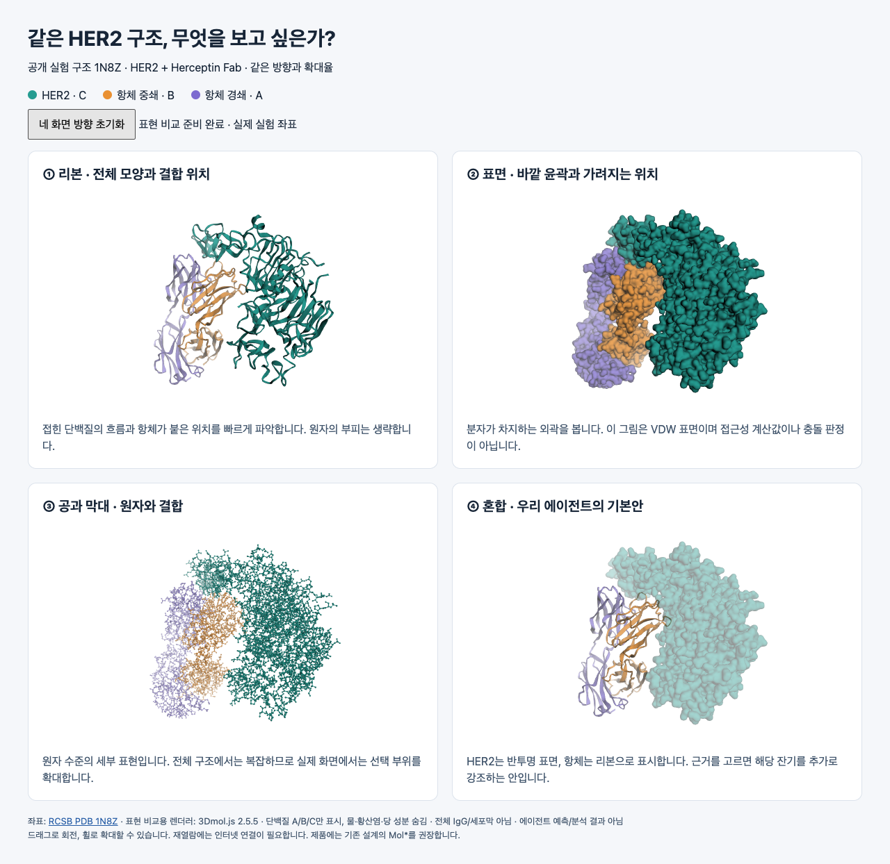

# HER2 3D 조사와 표현 비교

## 후속 구현 — 2026-09-25

### 가독성 개선 — 사용자 추가 승인

최종 사용자 조정: 확대 보기 기능을 제거하고, 구조 이름 표시는 기본 꺼짐(사용자가 켤 수 있음), 표현·출처·표시 범위는 접지 않고 항상 표시하도록 변경했다. 아래 확대 관련 기록은 앞선 구현·검증 이력이며 현재 기능에는 포함되지 않는다.

전체 보기에서는 HER2 표면을 기본 불투명하게 표시하고 항체 리본과 분리했다. 구조 이름을 켜면 HER2·중쇄·경쇄의 정식 이름을 고정된 색상 범례에서 보여주며 분자 위에 붙는 글자는 사용하지 않는다. 접촉 부위 보기에서는 사슬별 색을 유지한 공과 막대를 선명하게 표시하고 나머지 단백질을 흐리게 한다. 전체/접촉/주변 성분의 시점 초기화와 브라우저 확대 보기, 항체 숨기기, HER2 불투명도 조절을 추가했다.

`확보된 당·기타 성분 보기`를 켜면 물을 제외한 비단백질 성분을 자홍색으로 강조하고 해당 성분 집합으로 시점을 이동한다. 넓게 떨어진 성분은 함께 보이도록 맞추며 개별 당쇄 부위의 과학적 판단은 하지 않는다. 끄면 전체 보기로 돌아온다. 접촉/성분 집중 보기에서는 자동 회전 재개를 비활성화하고, 전체 보기에서 명시적으로 재개한다.

표시·불투명도·항체 숨기기는 파일을 다시 읽지 않고 기존 표현을 갱신한다. 중요한 표시 경계(항체 숨김, 주변 성분은 확보된 자료만 표시)는 설명과 체크 상태에 유지한다. Chrome에서 두 후보의 잔기 선택 39/56개, 성분 강조·카메라 이동, 숨기기·불투명도, 확대 진입/복귀, 390px 가로 넘침 없음, 화면 해제, pageerror 없음과 빌드를 확인했다. 전체/접촉/성분/모바일 스크린샷을 직접 검토했다.

사용자 승인으로 사이트 B안의 구조 영역에 Mol* 공개 구조 미리보기를 적용했다. 아래 조사 시점의 미구현 표시는 당시 기록이며 현재 적용 범위는 이 절이 기준이다.

- Herceptin(1N8Z) / pertuzumab(1S78)을 선택하면 assembly 1의 HER2와 해당 Fab만 표시한다. 모의 분석 후보와는 별도의 공개 예제 선택이며 실험적 후보 평가 결과로 표시하지 않는다. 두 구조 사이의 정렬·동일 시점 비교는 아직 없으며 전환 시 전체 보기로 초기화한다.
- 기본 HER2 반투명 표면 + 항체 리본, 리본/표면 전환, 주변 성분 표시를 제공한다. 물은 숨기고 확보된 비단백질 성분만 보여준다. 완전한 당쇄·세포 환경이 아니다.
- 중원자 간 거리 4.5 Å 이내인 양쪽 잔기를 미리 계산해 질문 버튼에 연결했다. 1N8Z 39개, 1S78 56개이며 결합력·충돌·실험 epitope 판정이 아닌 공개 예제의 기하학적 근접 표시다. label 사슬·잔기로 선택하며 실제 선택된 고분자 잔기 수와 메타데이터 개수도 검사한다.
- 기본 회전은 초당 0.025회(40초/회전). 포인터 조작·휠·근거 선택·전체 보기에서 정지하고 명시적인 재개 버튼으로 다시 움직인다. OS 동작 줄이기 설정에서는 기본 회전과 카메라 전환 애니메이션을 끈다.
- Mol*는 지연 로딩한다. 파일은 로컬 공개 예제로 제공하고 SHA-256 검증 후 표시한다. 요청 취소·viewer 해제·새 canvas 생성으로 빠른 전환과 unmount를 처리한다. 다운로드 실패 시 사유와 재시도를 제공한다.

구현: `frontend/src/StructurePreview.tsx`, `frontend/src/molecular-viewer.ts`. 원본: `frontend/public/structures/`. [근접 잔기 생성 스크립트](assets/3d-research/build-contacts.py)는 `uv run --no-project --with biopython python docs/frontend-hosting/assets/3d-research/build-contacts.py`로 재현한다. 원본 파일·해시·assembly 확인은 앞선 조사와 동일하다. 사용자 결과 API 연결은 후속 작업이다.

검증: TypeScript·Vite 빌드, Chrome의 두 구조와 근접 잔기 39/56개 선택, 실제 canvas 이미지 변화로 자동 회전/정지 확인, 재개·focus 정지, 주변 성분·리본 전환, 390px 가로 넘침 없음, unmount, reduced-motion, HTTP 503 안내·재시도 통과. 최종 브라우저 검사 pageerror 없음. Mol* 청크 약 2.79MB(압축 약 781KB) 경고가 있으며 지연 로딩으로 분리했다. 과학적 유용성·실제 기기의 성능 평가는 미완료.

조사일: 2026-09-25. 사용자 요청에 따라 **제품 구현 전 조사·이미지 비교**까지 진행했다. 기존 인계의 실제 Mol* 통합 단계는 남아 있다. 아래 추천은 기존 아키텍처를 구체화한 제안이며 과학적 판정 기준이나 최종 데모 후보의 확정이 아니다.

## 1. 먼저 구분할 세 가지

분자 3D는 보통 사람이 외형을 조각하는 작업이 아니다. **원자의 이름과 x·y·z 좌표가 있는 파일**을 읽고, 뷰어가 선·리본·구·표면으로 그린다. 단백질 서열만 있는 FASTA는 좌표 파일이 아니므로 기존 구조 조회나 구조 예측이 먼저 필요하다.

| 구분 | 쉬운 설명 | 우리 프로젝트의 제안 |
|---|---|---|
| 파일 형식 | 어떤 정보를 저장하는가 | 원본 mmCIF + 분석 결과 JSON |
| 표현 방식 | 같은 좌표를 어떻게 그리는가 | HER2 표면 + 항체 리본, 선택 잔기는 원자 표시 |
| 뷰어 | 화면에서 회전·선택을 처리하는 도구 | 기존 설계의 Mol* 유지 |

작은 단위부터 **원자 → 잔기(아미노산 한 단위) → 사슬 → 복합체**로 이해하면 된다. 사슬은 좌표 파일 안의 식별 단위이며 A가 항상 HER2라는 뜻은 아니다. Model은 파일 안의 좌표 모델, assembly는 생물학적 조립체, operator는 조립에 적용하는 변환이다. 비대칭 단위 전체와 분석할 조립체가 같다고 가정하지 않는다. [mmCIF 안내](https://mmcif.wwpdb.org/docs/faqs/pdbx-mmcif-faq-general.html)

## 2. 같은 실험 좌표로 비교한 네 가지 그림



[회전 가능한 비교 자료](assets/3d-research/comparison.html). 인터넷이 필요하며 구조 파일의 SHA-256이 달라지면 표시를 중단한다. 이미지는 다운로드한 원본 좌표를 렌더링한 것으로 AI가 그린 분자 그림이 아니다.

| 표현 | 잘 보이는 것 | 한계 | 사이트에서의 용도 |
|---|---|---|---|
| 리본 / cartoon | 접힘과 전체 배치, 항체 위치 | 원자 부피와 세부 접촉이 생략됨 | 전체 보기, 항체 두 사슬 구분 |
| 표면 / surface | 외곽과 가려지는 영역 | 내부 구조가 가려지고 표면 정의에 따라 모양이 달라짐 | HER2 외형, 주변 성분과 공간 관계 |
| 공과 막대 / ball-and-stick | 원자와 결합, 선택 부위의 세부 | 전체 복합체에 쓰면 복잡함 | 근거 선택 후 해당 부위 확대 |
| 혼합 | 전체 맥락과 항체 배치를 함께 읽음 | 투명도·색상·선택 규칙 필요 | 기본 보기 추천 |

그림은 동일한 1N8Z 좌표·방향·확대율이며 단백질 A/B/C만 표시했다. 물·황산염·당 성분을 숨겼으므로 이 그림으로 당쇄 접근성을 판단하면 안 된다. 표면은 3Dmol.js의 **VDW** 표현이며, 탐침을 쓰는 SAS/SES나 정량 SASA 계산과 동일하지 않다. 제품에서 표면 알고리즘을 바꾸면 종류와 설정을 기록해야 한다. Mol*도 여러 표현을 지원하지만 도구 간 그림이 완전히 같다는 뜻은 아니다. [Mol* 표현](https://molstar.org/viewer-docs/managing-the-display/), [3Dmol 표면 종류](https://3dmol.org/doc/global.html)

표현 비교용 렌더러는 3Dmol.js 2.5.5다. 이 선택은 조사 자료 제작에 한정되며 제품 의존성에 설치하거나 기존 Mol* 결정을 바꾸지 않았다. 실제 비교 페이지에서 네 화면을 회전할 수 있지만 카메라는 독립적이며 초기화 버튼으로 같은 방향에 복귀한다.

## 3. 파일 형식은 무엇을 선택할까?

| 형식 | 들어 있는 것·성격 | 판단 |
|---|---|---|
| PDBx/mmCIF `.cif` | 원자 좌표와 구조화된 사슬·잔기·조립체 메타데이터 | 원본 및 분석 산출물의 기본안. author/label 번호 보존 |
| legacy PDB `.pdb` | 고정 폭 텍스트 기반 원자 좌표 | 외부 입력 호환용. 제한 때문에 모든 구조를 표현하지 못함 |
| BinaryCIF `.bcif` | CIF 계열 데이터를 이진 인코딩 | 크기·파싱 병목을 실측한 뒤 전송 최적화 검토. 첫 데모 필수 아님 |
| FASTA / 결과 JSON | FASTA는 서열, JSON은 ID·근거·좌표 파일 참조 등 | 각각 단독으로 분자 표면이 되지 않음. 좌표와 연결해야 함 |
| GLB/glTF·OBJ·STL | 일반 3D 메시·장면 교환 | 소개용 장면에는 가능하나 사슬·잔기 선택을 위한 분자 원본으로 삼지 않음 |

**mmCIF + JSON으로 시작**하고, PDB 입력은 원본을 보존하며 검증·변환한다. BCIF는 API 계약의 지원 형식과 변환 정밀도를 검토한 뒤 추가한다. GLB 등을 분석용으로 쓰려면 별도 잔기 대응 정보가 필요하므로 현재 요구에는 불필요한 변환이다. [wwPDB 형식 설명](https://mmcif.wwpdb.org/docs/faqs/pdbx-mmcif-faq-general.html), [RCSB 다운로드 형식](https://www.rcsb.org/docs/programmatic-access/file-download-services), [BinaryCIF 규격](https://github.com/molstar/BinaryCIF/blob/master/encoding.md)

## 4. 어떤 웹 뷰어가 맞을까?

| 선택 | 공식 기능에서 확인한 적합성 | 우리 작업에서의 판단 |
|---|---|---|
| Mol* | 구조·서열·잔기 선택, 선택 이벤트, 다양한 표현과 중첩 | 기존 아키텍처와 일치. 근거표↔잔기 연결이 핵심이므로 추천 |
| 3Dmol.js | 코드로 스타일·표면·선택을 제어하는 분자 뷰어 | 작은 표현 비교 실험에 적합. 이번 자료에서만 실행 검증 |
| NGL | 여러 분자 표현과 선택을 제공하는 웹 시각화 도구 | 대안은 되지만 현재 Mol* 선택을 바꿀 근거는 확인되지 않음 |

성능 우열을 벤치마크한 표가 아니다. Mol*의 기능 지원과 **우리 React 앱에서의 정상 동작**은 별도 검증 대상이다. 일반 Three.js 장면부터 분자 파서·잔기 선택을 새로 만드는 경로는 현 요구에 비해 작업이 커진다는 판단이다. [Mol* 선택 API](https://molstar.org/docs/plugin/selections/), [3Dmol API](https://3dmol.org/doc/), [NGL API](https://nglviewer.org/ngl/api/)

## 5. 공개 구조에서 실제 확인한 사항

2026-09-25 RCSB 원본 mmCIF 두 개를 다시 내려받아 Biopython MMCIF2Dict로 entity·사슬·assembly 생성 규칙을 읽었다. 아래 사슬 목록은 **label_asym_id** 기준이다.

| 항목 | 1N8Z | 1S78 |
|---|---|---|
| 구조 | HER2–Herceptin Fab | HER2–pertuzumab Fab |
| 단백질 역할 | HER2 C, 경쇄 A, 중쇄 B | HER2 A/B, 경쇄 C/E, 중쇄 D/F |
| assembly | 1: A,B,C,D,E,F,G,H,I | 1: A,C,D,G,H,L / 2: B,E,F,I,J,K,M |
| 생성 operator | 1 | 두 assembly 모두 1 |
| 원본 atom_site 행 수 | 7,890 | 15,481 |

1S78에는 단백질 복합체 두 벌이 있으므로 전체 파일을 단일 후보의 단일 복합체로 자동 취급하지 않는다. 1N8Z에서는 label D/E/F 및 I가 author C와 대응한다. 따라서 `chain C`라는 문자열만으로 HER2 단백질과 비단백질 성분을 안전하게 구분할 수 없다. 비교 그림은 렌더러가 해석한 비-HETATM 단백질 원자 7,778개를 각각 사용했으며 제품용 선택 계약은 author/label을 명시해야 한다.

Fab은 항체의 항원 결합 부분이며 전체 Y자 IgG가 아니다. 이들 좌표가 세포막과 모든 당쇄를 포함한 실제 환경을 뜻하지 않는다. 두 구조는 표시 검증용 기준 후보이며 최종 데모 입력으로 확정하지 않았다. [1N8Z](https://www.rcsb.org/structure/1N8Z), [1S78](https://www.rcsb.org/structure/1S78)

원본 출처·해시는 [검증 메타데이터](assets/3d-research/verified-structures.json)에 기록했다. 원본 다운로드: [1N8Z.cif](https://files.rcsb.org/download/1N8Z.cif), [1S78.cif](https://files.rcsb.org/download/1S78.cif). 원본 파일 자체는 이번에도 Git에 추가하지 않았다. 잔기별 원서열 대응·접촉 계산·두 구조 정렬은 아직 수행하지 않았다.

## 6. 우리 사이트에서 보여줄 방식

추천 흐름은 **쟁점 선택 → 근거가 가리키는 위치 확인 → 후보 또는 조건 비교**다. 회전 가능한 분자를 크게 띄우는 것만으로 검토가 완료되지는 않는다.

1. 기본은 한 개의 뷰어: HER2 반투명 표면 + 항체 리본. 옆 근거표에서 항목을 고르면 정확한 잔기 집합을 강조하고 확대한다. 색상 범례는 HER2/중쇄/경쇄로 유지한다.
2. `전체 / 선택 부위 / 주변 성분`은 표시 프리셋이다. 당쇄 표시 토글은 이미 있는 원자를 숨기거나 보여줄 뿐, 새 분석 조건을 계산하거나 없던 당쇄를 생성하지 않는다.
3. 후보 비교는 두 화면을 나란히 보는 모드부터 검토한다. 같은 방향으로 연결하려면 HER2의 대응 구간과 정렬 변환이 먼저 필요하다. 단순히 카메라 값만 복사해서 정렬됐다고 표시하지 않는다.
4. 중첩은 필요할 때 켠다. 기준 HER2를 고정하고 항체를 색으로 구분하되 정렬 구간·좌표 유무·변환 적용 여부를 함께 표시한다. 대응이 없으면 중첩을 비활성화하고 이유를 설명한다.
5. 예측 신뢰도 색칠은 실제 지표와 잔기 대응이 제공될 때 별도 모드로 제공한다. 실험 구조의 B-factor를 pLDDT로 읽거나 신뢰도를 결합력으로 표현하지 않는다.

핵심 기본 기능은 전체 보기·회전/확대·초기화·후보 선택·근거 잔기 강조다. 서열 패널은 필요한 때 펼치고, 구조가 없거나 WebGL/파일 로딩이 실패해도 근거표는 읽을 수 있게 한다. 좁은 화면은 후보를 전환하고, 두 뷰어 동시 표시·고해상도 표면은 실제 장치에서 검증한 후 적용한다. [Mol* 기본 조작](https://molstar.org/viewer-docs/), [중첩 API](https://molstar.org/docs/plugin/superposition/)

## 7. 구현으로 옮길 때의 연결 구조

기존 [아키텍처](../ARCHITECTURE.md#3-화면과-분석의-책임)와 [임시 규격 §5](temporary-contract.md#5-결과와-3d-데이터)를 따른다.

```text
공개 구조 또는 모델 응답
 → 분석 담당: 후보·사슬·잔기 대응, 조건별 계산, 정렬 기록
 → 서버: mmCIF artifact + JSON 결과 스냅샷
 → React: 후보/조건/근거 ID 선택
 → Mol*: 같은 구조와 잔기 선택·확대·표현
```

JSON에는 구조 출처·실험/예측 종류·파일 해시·model·assembly·operator, author/label 사슬·잔기·삽입 코드·좌표 유무, 근거가 참조하는 잔기 집합, 정렬 기준·변환·적용 여부가 필요하다. 구조의 좌표와 화면상의 메시를 React 상태에 복사하지 않는다. Mol*를 지연 로딩하고 화면 해제 시 그래픽 자원과 구독을 정리한다.

공개 예제 자료의 외부 URL 접근은 이번 연구 자료에 한정된다. 제품 결과는 `/api/artifacts/{artifact_id}`로 조회하며, mock fixture를 실제 구조가 준비된 결과로 바꾸지 않는다. 에이전트는 검증된 계산과 근거 ID를 제공하고, 뷰어는 임의 접촉·충돌 점수나 판정을 만들지 않는다.

## 8. 확인 범위와 다음 단계

확인: 두 원본 파일 해시와 entity/assembly 메타데이터, Chrome에서 네 표현 렌더링과 각각 단백질 원자 7,778개, 마우스 회전 후 카메라 변경·초기화 복원, 390px 화면의 가로 넘침 없음, 다운로드 503 오류 안내, 런타임 오류 없음, PC·모바일 이미지 육안 검토. 조작 자동 검사는 원본과 라이브러리의 로컬 사본으로 실행했으며, 별도 검사에서 외부 RCSB/CDN을 직접 읽어 네 표현이 준비되는 것도 확인했다. 이는 로컬 호스트에서의 단일 실행이며 배포 환경의 지속적 가용성을 보장하지 않는다.

미확인: 제품 Mol* 설치/통합, 실제 후보·잔기 선택 계약, 접촉·접근성·충돌 계산, 후보 간 정렬, 에이전트/NIM 반환, 실제 기기의 성능·GPU 자원 해제. 이번 조사는 기존 인계의 S2 전체 완료나 C7 통과가 아니다.

다음 구현의 완료 기준: 공개 예제 1건에서 구조·사슬·잔기 대응을 검증하고 Mol*로 로딩 → 근거 선택 → 정확한 잔기 강조를 확인한 다음, 후보 전환·오래된 요청 취소·파일 오류·누락 잔기·화면 해제를 검사한다. 과학적 임계값과 최종 후보는 [검증 기준](../topics/her2/validation.md#구현-전에-정할-항목)에 따라 분석 담당과 결정한다.
