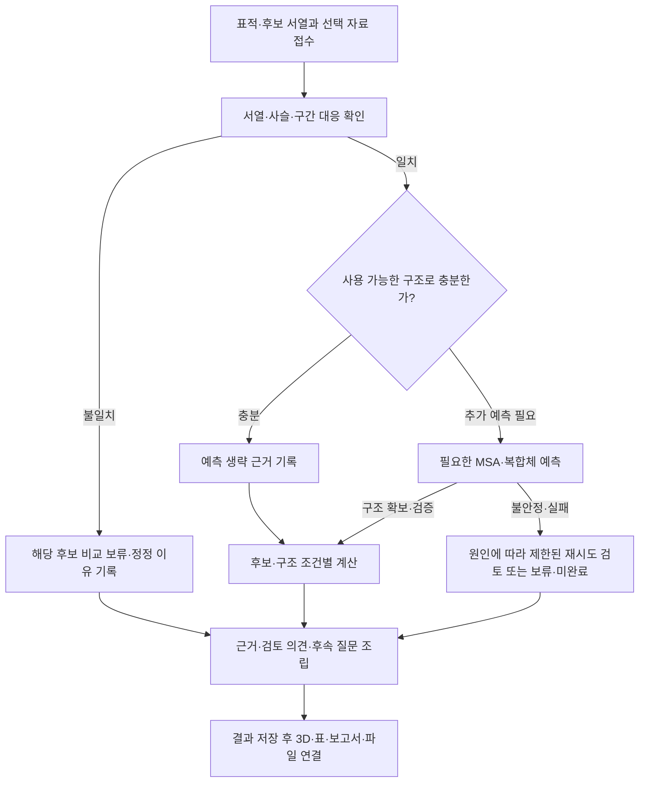

# 서비스에서 알아야 할 HER2 에이전트 로직

조사일: 2026-09-25. 아래 흐름은 [기존 에이전트 설계](../topics/her2/agent-design.md)·[ARCHITECTURE](../ARCHITECTURE.md)를 서비스 관점으로 풀어쓴 것이다. 구현된 함수나 실제 분석 결과가 아니다.

## 1. 큰 그림과 용어

이 서비스는 입력된 항체 후보가 HER2의 어디에 접근·접촉하는지, 확보한 구조 조건에서 어떤 우려와 정보 공백이 있는지를 비교한다. 사용자가 받는 것은 **구조와 근거가 연결된 검토 의견·후속 질문**이며, 항체 생성이나 치료 효능 순위가 아니다. [프로젝트 개요](../topics/her2/overview.md)

| 용어 | 서비스에서의 의미 |
|---|---|
| 표적·후보 | HER2가 표적, 서로 비교하는 항체 2–3개가 후보. 후보별 중쇄·경쇄 입력과 식별이 필요 |
| 서열·구조 | FASTA는 서열 입력에 사용하고 PDB·mmCIF는 좌표와 구조 주석을 담는다. 서열만으로 화면에 표시할 3D 좌표가 생기지는 않음 |
| 사슬·잔기 대응 | 사용자가 입력한 서열 위치와 구조 파일의 사슬·잔기 식별자를 연결한 정보 |
| 구조 조건 | 같은 후보라도 HER2–항체 중심 / 확보한 당쇄·주변 구조 포함을 구분한 분석 조건 |
| MSA | 유사 서열의 다중 정렬. 기존 설계에서는 필요한 구조 예측의 준비 자료이며 사용자에게 3D 결과로 제시할 좌표 파일과 다름 |
| 실행·의견 | 실행은 프로그램이 어디까지 끝났는지, 의견은 해당 근거로 어디까지 판단 가능한지를 나타냄 |

후보별 유효 결과를 보존하는 개념도다. `R`로 연결되었다고 항상 완전한 결과가 생기는 것은 아니며, 유효 결과 유무에 따라 partial·failed 등이 갈린다. 후보·단계의 병렬 실행이나 재시도 횟수는 이 그림으로 확정하지 않는다.

## 2. 단계별 입력·판단·산출물

| 단계 | 로직이 읽고 판단하는 것 | 남겨야 할 산출물 — 기존 설계 기준 | 서비스에 필요한 이유 |
|---|---|---|---|
| 입력 접수 | HER2 식별자/서열, 후보 중쇄·경쇄, 형식·분석 구간, 선택 구조 | 원본 입력·파일 참조, 입력 오류 위치와 이유, 검토 식별자 | 입력 수정과 이전 결과를 분리하고 잘못된 필드로 안내 |
| 자료 대응 | UniProt·RCSB·선택 자료에서 후보·사슬·구간이 맞는지 확인 | 후보↔서열↔구조↔사슬·잔기 대응, 누락 구간, 출처 | 표의 잔기를 3D에 정확히 표시하고 비교 불가 후보 설명 |
| 결합 부위 검토 | 사용할 구조와 실험 근거가 있는지 확인, 접촉·표면 검토 | 근거 종류, 사용 구조, 지표의 값·단위·정의·대상 위치 | 실험 사실과 계산값을 다른 근거로 표시 |
| 필요 예측 | 기존 구조의 충분성, 필요한 MSA·예측 조건과 호출 한도 | 예측 생략 이유 또는 요청·응답·설정·구조·신뢰도·실패 기록 | 예측을 항상 실행하는 고정 진행률을 피하고 실제 산출물만 표시 |
| 조건별 비교 | 입력 오류·접촉·충돌·정렬·자세 차이, 당쇄·주변 자료 공백 | 후보·조건별 근거, 정렬 범위·변환, 충돌 위치·누락 이유 | 같은 후보의 조건 전환과 3D·표 선택 연결 |
| 의견·보고 | 어떤 판단이 가능하고 근거가 충돌하거나 부족한가 | 범위 있는 의견, 근거 ID, 반대 근거·한계·후속 질문, 결과 스냅샷 | 한 점수로 축약하지 않고 의견에서 출처·위치까지 추적 |

자료 조회·Biopython·FreeSASA 계산 함수는 직접 구현할 영역이다. Nemotron은 허용된 다음 작업 선택과 설명, NAT는 함수 연결·실행 추적을 맡는 기존 설계다. 이 프로젝트용 함수명·반환 스키마는 아직 없다. NAT 공식 문서도 출력 스키마를 주로 문서화 용도로 설명하므로, 스키마 선언만으로 결과 내용·근거 연결이 검증된다고 보지 않는다. [NAT 함수 문서](https://docs.nvidia.com/nemo/agent-toolkit/latest/extend/custom-components/custom-functions/functions.html)

## 3. 화면에서 구분해야 하는 분기

| 관찰된 상황 | 로직의 처리 기준 | 화면·운영에 보존할 정보 |
|---|---|---|
| 일치하는 실험 구조로 충분 | 불필요한 복합체 예측 생략 | 사용 구조·출처, 생략 단계·이유. 실행 오류로 표시하지 않음 |
| 서열·사슬·번호 불일치 | 그 후보의 해당 비교 중단, 정정 안내 | 후보·필드·위치·불일치 이유. 다른 후보 결과를 지우지 않음 |
| 당쇄·주변 좌표 부족 | 해당 접근성 판단 보류 또는 자료 보완 | 미확인 항목·영향받는 판단. “당쇄 없음”으로 표시하지 않음 |
| 여러 예측 자세가 불일치 | 조건 기록, 한도 안에서 재실행 검토 또는 보류 | 구조별 ID·설정·일관성 근거·남은 한계 |
| 높은 신뢰도와 충돌 근거 공존 | 각각 보존, 입력 오류·충돌을 점수로 덮지 않음 | 지표별 출처·조건·상충 이유 |
| 외부 API timeout | 성공 여부·요청 ID·조회 가능성을 확인 | 실패/불확실한 단계, 생성되지 않은 결과, 재호출 확인 필요 여부 |
| 계산은 성공, 설명 생성은 실패 | 계산 결과를 보존하고 설명 미완료를 표시 | 계산 산출물과 보고 생성 상태를 별도로 전달 |

이 분기는 [HER2 검증 기준](../topics/her2/validation.md)과 [PRD F03–F10](../PRD.md)의 화면 검증 입력이 된다. 단계별 종료 상태 코드와 작업 전체 상태의 집계 규칙은 로직·서비스 공동 검토 대상이다.

## 4. 실제 공개 구조를 읽어 확인한 서비스 연결 문제

이번에는 RCSB Data API의 entry·polymer entity 응답과 원본 mmCIF의 `_atom_site` 행을 조회했다. 서열 정렬·접촉 계산·assembly 재구성·viewer 실행은 하지 않았다. 아래 서열 길이는 RCSB entity 메타데이터의 값이며 관측 잔기 수나 최종 분석 구간 길이가 아니다.

| 확인 항목 | 1N8Z | 1S78 |
|---|---|---|
| RCSB 설명 | HER2 세포외 도메인–Herceptin Fab | ErbB2–pertuzumab 복합체 |
| 고분자 entity·사슬 | 경쇄 A(214), 중쇄 B(220), HER2 C(607) | HER2 A·B(624), 경쇄 C·E(214), 중쇄 D·F(226) |
| entry의 assembly ID 목록 | 1 | 1, 2 |
| 원본 CIF 파일 크기 | 845,613 bytes | 1,619,308 bytes |
| `_atom_site` 행 수 | 7,890 | 15,481 |
| HETATM 행의 residue name | HOH, NAG, SO4 | BMA, NAG |

출처: [1N8Z 구조](https://www.rcsb.org/structure/1N8Z), [1S78 구조](https://www.rcsb.org/structure/1S78), [1N8Z entry API](https://data.rcsb.org/rest/v1/core/entry/1N8Z), [1S78 entry API](https://data.rcsb.org/rest/v1/core/entry/1S78). Entity API는 `https://data.rcsb.org/rest/v1/core/polymer_entity/{PDB}/{entity_id}`의 각 1·2·3을 조회했다. 원본 파일은 [1N8Z.cif](https://files.rcsb.org/download/1N8Z.cif)·[1S78.cif](https://files.rcsb.org/download/1S78.cif)다.

**서비스 연결에 주는 확실한 제약:** 사슬 A를 언제나 HER2로 해석할 수 없다. 또 1S78의 파일 전체를 한 후보의 단일 복합체로 자동 처리할 수 없으므로 로직 담당이 분석할 assembly·사슬 조합을 지정해야 한다. 두 공개 구조를 최종 데모 후보로 선정한 것은 아니다.

1N8Z의 atom_site에는 label 사슬 D·E·F가 author 사슬 C로 대응하는 행도 있었다. 즉 author 사슬 하나만 선택하면 단백질 외 성분이 함께 포함될 수 있다. `_atom_site.label_asym_id`와 `auth_asym_id`, `label_seq_id`와 `auth_seq_id`는 구별되는 체계이며, mmCIF 공식 가이드가 차이와 대응 항목을 설명한다. [wwPDB mmCIF 가이드](https://mmcif.wwpdb.org/docs/user-guide/guide.html)

NAG 등의 좌표 행을 확인한 것만으로 전체 당쇄가 완전하다거나 접근성 계산에 실제 포함되었다고 결론내리지 않는다. 파일 크기·행 수도 브라우저 메모리, 업로드 한도, 분석 RAM 요구량으로 환산하지 않는다.

재확인용 SHA-256:

- 1N8Z.cif: `9f22f02b6e514de56dab8a48bc31a16302a51397779e64c398ad3a7f05cb19a2`
- 1S78.cif: `468b0fa0d3368c1d8971d26e896a7ed8b938437dfa5eb55132ef24ef0033d9f0`

조회 방법: Python 표준 라이브러리로 공개 HTTPS 응답을 읽고 JSON 필드 및 CIF atom_site 헤더에 대응한 행을 집계했다. 이는 이번 두 파일의 점검이며 제품용 범용 CIF 파서 검증을 대체하지 않는다. 파일은 저장소에 입력 데이터로 추가하지 않았다.

## 5. 예측 API가 화면에 직접 연결되지 않는 이유

NVIDIA의 Boltz-2 참고 문서는 `polymers` 요청과 응답의 `structures` 내 mmCIF 문자열·`confidence_scores`·`metrics`를 설명한다. 서버는 원본 응답을 보존하면서 구조 파일과 서비스용 식별자·근거로 변환해야 한다. 응답 이름이나 배열 순서만으로 우리 후보·입력 사슬과의 대응이 검증되는 것은 아니다. [NVIDIA Boltz-2 API 참고](https://github.com/NVIDIA-BioNeMo/bionemo-agent-toolkit/blob/main/nim-skills/boltz2-nim/references/api.md)

해당 문서의 `affinities`는 ligand 친화도 요청과 연결된 항목이다. 이를 항체 후보의 결합력 점수로 노출하지 않는다. ipTM·PAE·잔기별 신뢰도 등은 실제 반환과 해석 기준을 확인하기 전 필수 결과 필드로 약속하지 않는다. 이는 공식 참고 규격 조사이며 우리 계정의 호출 성공·반환 형식·시간·한도 검증은 아니다. [프로젝트 도구·해석 범위](../tools/her2-toolkit.md)

프런트가 필요로 하는 것은 공급자 전체 JSON이 아니라 **어느 실행·후보·조건의 어떤 구조인지, 실제 제공된 지표는 무엇인지, 어떤 계산·설명이 끝나지 않았는지**다. 구체적인 소비 정보는 [프런트 연동 요구](frontend-contract.md)에서 검토한다.
