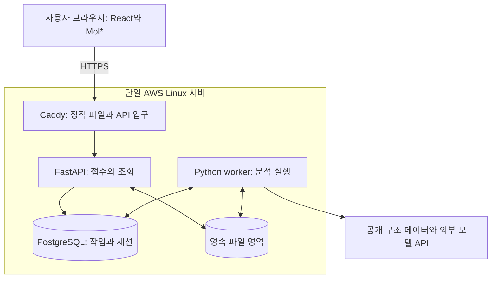

# Bio-3 서비스 호스팅 조사와 선택 가이드

조사일: 2026-09-26. 기준: main `b16dda9301c0b507488fe52fb935fa358eddb163`. 상태: 공식 자료와 저장소를 확인한 **배포 준비 제안**이며 AWS 자원 생성·실제 배포·모델 호출·부하 검증은 하지 않았다. 가격은 USD, 세금·환율·계정 크레딧 적용 전이다.

## 1. 무엇을 먼저 선택하면 되는가

**로컬 Docker Compose로 서비스 전체 흐름을 검증한 뒤, 같은 구성을 AWS의 단일 Linux 서버로 옮기는 경로를 권한다.** 현재 [ARCHITECTURE](../ARCHITECTURE.md)의 EC2 잠정안을 기준 경로로 유지한다. 다만 EC2를 바로 장기 가동하지 않고, 실제 분석 부하와 운영 예산을 확인한 뒤 EC2와 Lightsail 가상 서버 중 최종 선택한다. 이 조사는 기존 ADR의 결정을 바꾸지 않는다.

| 우선순위 | 제안 | 선택 근거와 조건 |
|---|---|---|
| 지금 | 로컬에서 FastAPI·worker·PostgreSQL·Caddy를 연결 | 실제 로직이 없어도 임시 계약으로 접수·진행·실패·만료·재시작을 검증 가능 |
| 기본 배포 경로 | EC2 한 대 + Docker Compose + EBS | 기존 설계와 일치. CPU·디스크·권한·운영을 직접 제어하고 분석 패키지 설치 조건을 확인하기 쉬움 |
| 예산 우선 대안 | Lightsail **가상 서버** + 같은 Compose | 외부 API 대기 위주이고 지속 CPU 부하가 낮다는 실측이 있으면 월 요금·초기 설정이 단순함 |
| 이후 확장 | ECS/Fargate + 외부 DB·파일 저장소 | 서버 분리·확장·독립 배포의 필요가 확인됐을 때 재설계. 첫 데모의 선행 작업으로 두지 않음 |

Docker는 AWS를 쓰기 위한 필수 기술은 아니지만, 이미 선택한 분석 패키지 환경을 개발 PC와 서버에서 재현하기 위해 사용한다. 단일 서버 Compose 운영은 Docker 공식 문서에도 있는 배포 경로다. 단일 호스트가 멈추면 웹·API·DB·분석이 함께 멈추므로 고가용성을 제공하는 구성은 아니다. [Docker 운영 배포](https://docs.docker.com/compose/how-tos/production/)

바로 실행할 준비 순서와 단계별 완료 기준은 [백엔드·배포 작업 계획](backend-deployment-plan.md)에 둔다. 같은 문서의 8절에는 GitHub Actions의 자동 CI → main 이미지 준비 → 수동 CD와 EC2의 OIDC·ECR·SSM 연결안을 정리했다. CI/CD는 제안 단계이며 workflow·배포 자동화는 아직 구현하지 않았다.

## 2. 현재 만들어진 것과 앞으로 만들어야 할 것

| 구분 | 이번 main에서 확인한 상태 | 배포에서 의미하는 것 |
|---|---|---|
| 프런트 | `frontend/`의 React·Vite·Mol* 소스, 빌드 명령, 모의 상태와 공개 구조 조회 코드 존재 | 화면 코드가 있으나 실서비스 API 연결 완료를 뜻하지 않음. 다른 세션의 미커밋 UI 변경은 이 조사에 포함하지 않음 |
| 서비스 계약 | [v0.1.0 임시 계약](temporary-contract.md), JSON Schema, 모의 시나리오 존재 | API·worker를 독립적으로 준비할 기준이 있음 |
| 분석 자료 | 첫 후보·구간은 [PRD Q04](../PRD.md)와 [A-01 입력](../topics/her2/a01-reference-inputs.md)에 반영 | 공개 구조·자료 조사와 운영 worker 구현을 구분해야 함 |
| 백엔드·배포 | 서비스용 FastAPI 서버·운영 worker·Dockerfile·Compose 설정은 확인되지 않음 | 프런트 폴더를 서버에 올리는 것만으로 분석 서비스가 되지 않음 |
| 로컬 도구 | macOS arm64, Docker CLI 29.4.0·Compose v5.1.2, Docker 서버 응답 확인 | Docker 설치부터 다시 시작할 필요는 없음. 프로젝트 이미지 빌드·패키지 호환성은 미검증 |
| AWS 도구 | 현재 에이전트 PATH에서 `aws` 명령을 찾지 못함 | 콘솔로 초기 설정 가능. 사용자 셸 설치 여부·계정 보유·권한·크레딧은 별도 확인 대상 |

이전 문서의 “서비스 코드가 없다”는 작성 당시 기록이다. 이번 상태 판단에는 위 main 소스 확인을 사용했다. 기존 `.env`의 비밀값을 읽거나 워크트리로 복사하지 않았다.

## 3. 처음 알아둘 용어

| 용어 | 이 프로젝트에서의 뜻 |
|---|---|
| 호스팅 | 내 PC를 꺼도 사용자가 접속할 수 있도록 인터넷상의 컴퓨터에서 서비스를 실행하는 일 |
| EC2 / Lightsail 가상 서버 | AWS에서 빌리는 Linux 컴퓨터. 앱 설치·업데이트·장애 대응은 팀이 수행 |
| Docker 이미지 | Python·시스템 라이브러리·서비스 코드를 묶은 실행용 패키지 |
| 컨테이너 | 이미지를 실제로 실행한 프로세스 환경. 네 컨테이너가 반드시 네 서버를 뜻하지는 않음 |
| Dockerfile / Compose | 각각 이미지 만드는 절차 / 여러 컨테이너의 실행·연결·저장 설정 |
| 볼륨 / EBS | 컨테이너 밖에 보존하는 데이터 영역 / EC2에 붙이는 AWS 디스크. 볼륨이 어느 실제 디스크에 있는지 확인해야 함 |
| Caddy·역방향 프록시 | 브라우저 요청을 받아 정적 파일을 주거나 `/api` 요청을 FastAPI로 전달하는 입구 |
| DNS / TLS·HTTPS | 도메인을 서버 주소에 연결하는 체계 / 접속을 암호화하고 인증서로 서버를 확인하는 방식 |
| VPC·서브넷 / 보안 그룹 | AWS 네트워크와 그 구획 / 서버에 도달하는 트래픽의 허용 규칙 |
| IAM 역할 | AWS 자원에 어떤 작업을 허용할지 정하는 권한. 사이트 이용자의 임시 세션과는 별개 |
| 레지스트리 | 빌드한 이미지를 보관하는 곳. 재배포할 때 같은 이미지 버전으로 실행할 수 있게 함 |

이미지는 데이터를 저장하는 곳이 아니다. 컨테이너를 새로 만들더라도 DB·결과가 유지되어야 하는 시간 동안은 별도 볼륨을 사용한다. 영속 볼륨도 호스트 고장이나 실수 삭제를 막는 백업은 아니며, 사용자 결과의 만료 삭제 정책을 대체하지 않는다. [Docker 컨테이너](https://docs.docker.com/get-started/docker-concepts/the-basics/what-is-a-container/), [Dockerfile](https://docs.docker.com/build/concepts/dockerfile/), [볼륨](https://docs.docker.com/engine/storage/volumes/)

## 4. 우리 서비스가 서버에 요구하는 것

HER2 후보 2–3개를 입력받아 공개 구조를 확인하고, 필요할 때 외부 모델을 호출해 구조를 비교한 뒤 근거·3D·보고서를 제공한다. 구조 신뢰도·접촉·충돌을 임상 효능으로 해석하지 않는 경계는 [프로젝트 개요](../topics/her2/overview.md)를 따른다.

3D 그림은 사용자 브라우저의 Mol*가 그린다. 서버는 구조 파일과 근거·잔기 대응표를 제공한다. 브라우저 3D가 느린 문제를 서버 GPU 구입으로 해결할 수 있다고 가정하지 않는다. 현재 모델 추론은 외부 API가 담당하는 설계이므로 초기 서버에 GPU를 전제하지 않는다.

**분석은 HTTP 요청 하나가 끝날 때까지 기다리는 방식으로 만들지 않는다.** API가 입력을 저장하고 실행 ID를 반환하면 worker가 계산하고, 화면은 상태를 조회한다. API 프로세스 안의 FastAPI `BackgroundTasks`만으로 긴 분석의 내구성·점유·복구를 해결하지 않는다. FastAPI도 무거운 별도 계산에는 별도 실행 도구를 검토하도록 안내한다. 이 프로젝트는 기존 DB 작업 점유 설계로 시작하고 Redis·Celery는 필요가 생길 때 검토한다. [FastAPI Background Tasks](https://fastapi.tiangolo.com/tutorial/background-tasks/), [현재 실행·복구 설계](../ARCHITECTURE.md)

| 요구 | 이유 | 배포 준비에 미치는 영향 |
|---|---|---|
| 긴 작업과 외부 대기 | 예측·설명 응답은 입력·제공자에 따라 변동. MSA는 현재 미연결·기본 실행 제외 | API와 worker 분리, 단계·외부 요청 ID 기록 |
| Python·시스템 패키지 | 구조 파싱·분석과 NAT 의존성 | 이미지 빌드·대표 입력 실행으로 호환성 확인 |
| API·worker의 파일 공유 | 접수 파일을 분석하고 생성 파일을 제공 | 단일 호스트 공유 볼륨이 초기 구성을 단순하게 함 |
| DB와 파일의 일관성 | 파일 없이 완료 상태가 남으면 결과가 깨짐 | 파일 완성·해시 검증 이후 완료 등록 |
| 공개 접수·개별 비공개 결과 | 누구나 실행하되 타인의 결과는 읽지 못해야 함 | 세션 소유권 검증, 대기·호출·입력 상한 |
| 임시 결과 만료 | 사이트 이탈 후 자료 정리 요구 | 주기적 정리, 재시작 후 정리 재개, 백업 정책 제한 |

## 5. 호스팅 선택지 비교

### EC2와 Lightsail 가상 서버

| 비교 | EC2 + Compose | Lightsail 가상 서버 + Compose |
|---|---|---|
| 현재 설계 적용 | 그대로 준비 가능 | 동일한 단일 호스트 구성 유지 가능 |
| 처음 배울 것 | IAM·네트워크·EBS·공인 IP·서버 운영 | 번들·방화벽·고정 IP·서버 운영 |
| 비용 형태 | 컴퓨팅·디스크·IP·전송 등을 별도 계산 | CPU·RAM·디스크·일정 전송량이 번들에 포함 |
| CPU 부하 | 선택한 인스턴스 특성에 따라 조정 | 일반 목적 상품의 버스트 특성·지속 부하를 확인해야 함 |
| 운영 책임 | OS·Docker·DB·배포·복구 모두 팀 담당 | 콘솔이 단순해도 OS·Docker·DB 운영은 팀 담당 |
| 권고 조건 | 지속 계산 부하 또는 세밀한 AWS 설정이 필요 | 외부 API 대기 위주이며 단일 서버와 번들로 충분 |

Lightsail **Container Service**는 가상 서버 상품과 다르다. 이 문서의 대안은 가상 서버에 직접 Docker를 설치하는 방법이며, 기존 Compose·영속 볼륨을 Container Service에 그대로 넣을 수 있다는 뜻이 아니다. [Lightsail 번들](https://docs.aws.amazon.com/lightsail/latest/userguide/amazon-lightsail-bundles.html), [컨테이너 서비스](https://docs.aws.amazon.com/lightsail/latest/userguide/amazon-lightsail-container-services.html)

Lightsail의 4 vCPU가 EC2 m7i의 4 vCPU와 같은 지속 처리량이라는 근거는 없다. 일반 목적 Lightsail은 CPU 기준선과 버스트 용량을 확인하고, 실제 구조 계산을 반복해 성능이 유지되는지 측정한다. [Lightsail CPU 버스트](https://docs.aws.amazon.com/lightsail/latest/userguide/amazon-lightsail-viewing-instance-burst-capacity.html)

### 관리형 서비스와 정적 호스팅

| 대안 | 장점 | 지금 적용할 때 필요한 변경 | 이번 판단 |
|---|---|---|---|
| Render의 web·worker·Postgres | 앱 단위 배포, 별도 background worker 지원 | persistent disk는 한 서비스 인스턴스만 접근 가능. API와 worker의 공유 파일은 S3 같은 저장소와 객체 키로 바꿔야 함 | OS 운영 부담을 줄일 대안. 현재 파일 계약의 수정 비용을 포함해 비교 |
| ECS/Fargate | 호스트 관리 부담을 줄이고 컨테이너 단위 운영 | task·service·권한·네트워크·배포 구성, 외부 DB·파일 저장 계획 필요 | 첫 데모 후 확장 후보 |
| App Runner | HTTP 앱의 관리형 배포 | stateless 서비스 전제. 현재의 상시 worker·DB·공유 디스크 전체를 대체하지 않음 | API 부분만의 후보 |
| Lambda | 짧은 이벤트 처리에 적합 | 최대 실행 시간 900초, 영속 작업 상태·외부 파일·재시도 분리 필요 | 소요 시간 미정인 전체 분석의 첫 실행 환경으로 선택하지 않음 |
| 정적 웹 호스팅 | 프런트 미리보기 배포가 간단 | FastAPI·worker·DB는 별도 호스팅. 출처 분리 시 cookie·CORS·CSRF 설정 재검토 | 프런트 미리보기와 전체 서비스 배포를 구분 |

Render의 공유 디스크 제한 때문에 “네 서비스를 관리형에 옮기면 끝”으로 계산할 수 없다. Fargate의 임시 디스크도 작업 수명 밖의 결과 보관을 보장하지 않는다. EFS 같은 공유 저장소는 선택 가능하지만 추가 구성과 비용이 생긴다. 이는 공식 기능에서 도출한 **우리 구조에 대한 적합성 판단**이다. [Render 서비스](https://render.com/docs/service-types), [Render 디스크](https://render.com/docs/disks), [Fargate 임시 저장](https://docs.aws.amazon.com/AmazonECS/latest/developerguide/fargate-task-storage.html), [EFS 연동](https://docs.aws.amazon.com/AmazonECS/latest/developerguide/efs-volumes.html), [App Runner 저장 특성](https://docs.aws.amazon.com/pdfs/apprunner/latest/dg/apprunner-guide.pdf), [Lambda 한도](https://docs.aws.amazon.com/lambda/latest/dg/gettingstarted-limits.html)

## 6. 비용: 서버 요금과 전체 서비스 요금은 다르다

### EC2 기준 계산

조회 조건은 **서울(ap-northeast-2), Linux, m7i.xlarge, 4 vCPU·16 GiB, On-Demand, 별도 상용 소프트웨어 없음**이다. AWS 공식 가격 데이터에서 시간당 **$0.2478**을 확인했다. 공인 IPv4 한 개는 시간당 **$0.005**다. 아래는 같은 시간 동안 둘을 유지하는 산술 예시이며 할인·크레딧은 제외한다. [EC2 가격 안내](https://aws.amazon.com/ec2/pricing/on-demand/), [조회한 AWS 가격 데이터](https://b0.p.awsstatic.com/pricing/2.0/meteredUnitMaps/ec2/USD/current/ec2-ondemand-without-sec-sel/Asia%20Pacific%20%28Seoul%29/Linux/index.json), [IPv4 요금](https://aws.amazon.com/vpc/pricing/)

| 가동 가정 | 컴퓨팅 | 공인 IPv4 1개 | 두 항목 소계 |
|---|---:|---:|---:|
| 7일·168시간 | $41.63 | $0.84 | $42.47 |
| 14일·336시간 | $83.26 | $1.68 | $84.94 |
| 30일·720시간 | $178.42 | $3.60 | $182.02 |
| 견적용 730시간 | $180.89 | $3.65 | $184.54 |

**소계는 전체 견적이 아니다.** EBS 루트·데이터 디스크, 선택한 스냅샷, 인터넷 전송, 도메인·DNS, 이미지 저장·로그, 외부 모델 비용과 세금을 더해야 한다. 730시간은 비교용 가정이며 실제 가동 일정이 아니다. m7i.xlarge는 기존 부하 검증 후보이지 요구 사양으로 확정된 값이 아니다.

전체 비용식은 `컴퓨팅 시간 × 단가 + IP 보유 시간 × 단가 + 디스크 용량·기간 + 백업 + 전송 + 도메인·DNS + 로그·이미지 저장 + 모델 사용료 + 세금`이다. EBS는 파일이 차지한 크기만이 아니라 프로비저닝한 용량 등을 기준으로 과금하므로, 최종 리전·용량·IOPS·처리량을 정한 뒤 계산기에 넣는다. 이번 조사에서는 서울 gp3의 정확한 지역 요율을 추출·확정하지 않았으며 다른 리전 예시 단가로 대체하지 않았다. [EBS 요금](https://aws.amazon.com/ebs/pricing/), [AWS Pricing Calculator](https://calculator.aws/)

### Lightsail 비교 금액

Linux/Unix 일반 목적 IPv4 번들의 공식 표시 가격은 2 vCPU·8GB·160GB SSD가 **$44/월**, 4 vCPU·16GB·320GB SSD가 **$84/월**이다. 16GB 상품의 표기 전송량은 6TB이나 리전별 차이·초과 전송 과금을 확인해야 한다. 8GB가 우리 분석에 충분하다는 의미는 아니다. [Lightsail 공식 가격](https://aws.amazon.com/lightsail/pricing/)

서버에 연결된 고정 IP는 번들 조건을 따르므로 EC2의 IPv4 요금을 여기에 중복으로 더하지 않는다. 도메인·스냅샷·전송 초과·모델·세금은 별도다. Lightsail은 중지 상태에도 인스턴스 요금이 발생한다. EC2는 중지하면 컴퓨팅 과금이 멈추지만 보존한 EBS·스냅샷·Elastic IP 등은 남을 수 있다. [Lightsail 청구 FAQ](https://aws.amazon.com/lightsail/faq/), [EC2 중지·시작](https://docs.aws.amazon.com/AWSEC2/latest/UserGuide/Stop_Start.html)

### 과금 통제를 어떻게 설계할 것인가

AWS Budgets 알림은 실시간 차단기가 아니다. 공식 문서는 비용 갱신·알림 지연과 알림 전 초과 지출 가능성을 안내한다. 따라서 예산 알림과 함께 서버의 **전체 작업 접수 상한, 한 번에 실행할 작업 수, 실행별 외부 호출 한도, live 실행 비활성화 기능**을 준비한다. 익명 cookie별 제한만으로는 새 세션을 계속 만드는 요청을 막지 못한다. [AWS Budgets](https://docs.aws.amazon.com/cost-management/latest/userguide/budgets-managing-costs.html)

예산 상한이 아직 없으므로 유료 상품·예약 약정·장기 가동을 확정하지 않는다. 단기 해커톤에서 Reserved Instance·Savings Plans 구매를 첫 준비 단계에 넣을 근거도 없다.

## 7. AWS보다 먼저 확인할 외부 모델 경로

2026-09-26 재조회에서도 기존 Nemotron 모델은 **Free Endpoint: Deprecated**, Partner Endpoint: Available로 표시된다. 서버를 만들어도 해당 무료 경로의 사용 가능성이 해결되는 것은 아니다. 사용할 제공자·모델 ID·인증·요금·도구 호출 호환성을 실제 계정으로 확인해야 한다. [Nemotron 공식 페이지](https://build.nvidia.com/nvidia/nemotron-3-nano-30b-a3b)

Boltz-2 공식 페이지의 존재는 확인했지만 이번 조사에서 키를 사용한 호출이나 계정 quota는 시험하지 않았다. 기존 문서의 시험용 API·공개 데모 이용 조건 검토를 이어가되 무료·무제한·항상 가용하다고 전제하지 않는다. 외부 서비스의 보관 조건은 우리 DB 만료 정책과도 별개다. [Boltz-2 공식 페이지](https://build.nvidia.com/mit/boltz2), [기존 제공 경로·이용 조건 조사](hosting-requirements.md)

실제 모델 경로가 준비되지 않은 동안에도 mock 모드로 호스팅 흐름을 검증할 수 있다. 모의 성공을 실제 HER2 분석 성공으로 표시해서는 안 되며, 공개 데모에서 모의·기존 저장 결과·live 실행을 명확히 구분한다.

## 8. 최종 선택을 바꾸는 측정값

| 측정값 | 확인 방법 | 선택에 미치는 영향 |
|---|---|---|
| 단계별 시간 | 입력 대응·계산·외부 대기·보고 시간을 분리 기록 | API 대기가 대부분이면 CPU 증설의 효과가 작음 |
| 최대 메모리 | worker뿐 아니라 DB·API·호스트 포함 관찰 | 8GB·16GB 선택, 메모리 부족 종료 위험 |
| 지속 CPU | 대표 작업을 반복하고 작업 사이 회복 포함 측정 | Lightsail 버스트 구성의 적합성 |
| 작업별 디스크 최대치 | 원본·구조 복수본·보고·캐시 포함. MSA는 추가 검증 후 연결할 때 별도 산정 | 볼륨 크기와 동시 작업·대기 입력 상한 |
| 공급자 호출량·오류 | 요청 ID·호출 횟수·429·timeout·비용 기록 | 공개 접수량, 호출 상한, 시연 가능성 |
| 브라우저 표시 | 실제 구조 다운로드와 Mol* 메모리·렌더링 확인 | 서버 처리와 별도로 프런트 병목 식별 |

추천 선택 기준은 **기존 EC2 경로로 준비하되, 장기 가동 전 측정과 예산으로 확정**하는 것이다. 단기 실측 후 외부 대기 중심이면 Lightsail로 비용을 줄이는 안을 검토하고, 지속 CPU 계산·세밀한 AWS 연동이 필요하면 EC2를 유지한다. 정해진 예산을 넘으면 서버를 억지로 작게 잡기보다 운영 기간·실행 한도·배포 방식을 함께 조정한다.
