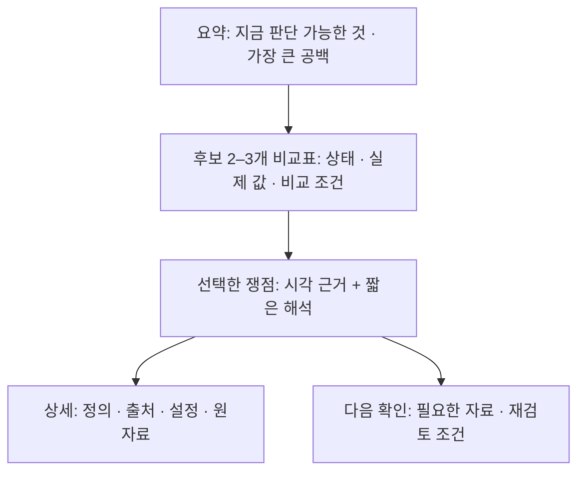

# 바이오 전문가의 결과 검토와 시각 중심 출력 구조

조사일: 2026-09-25. 사용자 요청: 텍스트를 읽고 필요한 정보를 추려내는 부담을 줄이되, 바이오 전문가에게 필요한 근거 확인을 잃지 않는 결과 구조를 조사한다. **3D 구현 조사와 별개의 결과 정보 구조 연구**다. 제품 코드는 변경하지 않았으며 제안은 전문가 평가 전이다.

## 1. 결론과 근거의 범위

현재 결과 화면은 **시각적 비교를 첫 단계로 두고, 상세 검증으로 내려갈 수 있게 개선할 가치가 있다.** 특히 반복되는 사유 문장을 비교표·쟁점·상세에 모두 노출하는 부분을 줄이는 것이 우선이다. 다만 근거의 출처·조건·정의·반대 근거를 제거해서는 안 된다.

‘바이오 전문가’ 전체가 긴 텍스트를 선호한다거나 시각적 요약을 선호한다는 대표성 있는 비율은 이번 조사에서 확보하지 못했다. 아래는 전문가 공동 설계 연구, 사용자 연구, 실제 도구의 기능, 최근 AI 연구의 산출물을 구분해 종합한 판단이다. 구조생물학·항체 공학에 직접 관련된 자료에 우선순위를 두고 유전체·실험 분석의 패턴은 보조 사례로 쓴다.

**핵심 질문은 글의 양보다, 어떤 비교·판단을 얼마나 적은 탐색으로 검증할 수 있느냐**다. 시각화는 위치·차이·분포를, 짧은 문장은 해석·조건·한계를, 상세 자료는 재검증을 맡기는 구성을 제안한다.

## 2. 실제 연구자와 도구에서 확인한 검토 방식

| 맥락 | 직접 확인한 패턴 | 우리에게 주는 시사점 | 일반화의 한계 |
|---|---|---|---|
| 구조생물학·단백질 공학 | 두 연구 그룹과 공동 설계한 연구에서 전체 복합체 집합→쌍→잔기 수준의 연계 탐색과 필터를 사용. 연구자는 기존 문헌 지식을 결합해 계산 점수만으로 선택하지 않음 [S1] | 후보 비교에서 근거 위치와 반대 근거까지 연결 | 대규모 도킹 집합 연구이며 HER2 사용자 선호 조사 아님 |
| RCSB 구조 검토 | 서열 주석과 3D가 양방향 선택으로 연결됨 [S2] | 같은 항목을 다른 패널에서 다시 찾게 하지 않기 | 기능의 존재는 사용률이나 선호 비율이 아님 |
| 실험 반응 분석 | Prism은 반응 곡선·적합값·신뢰구간을 함께 다루며 부적절한 적합과 불확실성을 설명 [S3] | 수치만 보여주기보다 조건·단위·관측 자료와 연결 | 우리 서비스는 아직 실험 측정값을 만들지 않으므로 곡선을 추가할 근거는 없음 |
| 유전체 연구 | 인터뷰 20명 및 탐색 연구 13명의 연구에서 시각화 제작 필요가 사용자·과제에 따라 다름 [S4] | 전문가 집단을 하나의 선호로 취급하지 않기 | 서로 다른 두 연구 표본이며 33명의 고유 참여자로 합산하지 않음. 제작 도구 연구를 결과 열람 선호로 단정하지 않음 |
| AI 구조 예측 검토 | AlphaFold 계열은 구조와 함께 지역 신뢰도·PAE 등 위치별 불확실성을 제공 [S5] | 예측 결과를 그럴듯한 한 장의 3D나 총점으로 끝내지 않기 | AlphaFold 기능이 우리 Boltz 출력에 존재한다고 가정하지 않음 |

역할에 따른 시작점도 다를 수 있다. 구조 분석자는 잔기·사슬·정렬을, 실험 담당자는 조건과 측정의 신뢰성을, 의사결정자는 다음 검토가 막힌 이유를 먼저 볼 수 있다는 **설계 가설**이다. 이 차이를 별도 사용자 모드로 바로 구현하기보다 공통 요약에서 각 상세로 진입하게 하는 편이 현재 2–3개 후보 범위에 적합하다.

## 3. 근거 확인에 텍스트가 얼마나 필요한가?

모든 근거를 첫 화면의 장문으로 보여줘야 한다는 결론은 확인되지 않았다. 근거는 문장 외에도 원자료, 좌표 파일, 정량값, 도표, 서열 대응, 계산 설정, 출처로 이루어진다. 아래 배치는 우리 서비스에 대한 제안이다.

| 항상 보일 것 | 선택하면 보일 것 | 상세·내보내기로 남길 것 |
|---|---|---|
| 후보·조건·비교 가능 여부, 핵심 결론 한 줄, 중요한 누락·충돌 | 선택한 쟁점의 위치·수치·단위·정의, 짧은 해석, 근거 종류 | 원출처, 상세 계산 설정·도구 버전, 전체 잔기 목록, 원본 구조·결과 파일 |
| 실제 측정/실험 자료·계산·모델 예측·미확인을 구분하는 표시 | 해당 근거가 지지하는 내용과 지지하지 못하는 내용 | 재현에 필요한 입력·해시·정렬 정보 |

중요한 보류 사유와 상충 근거는 접힌 패널 안에만 두지 않는다. ‘출처 3개’라는 개수보다 **어떤 주장에 어떤 종류의 근거가 연결되는가**를 보여준다. 구조가 실험으로 얻어졌어도 그 구조에서 계산한 접촉 지표까지 실험적 결합력 측정이 되는 것은 아니다.

## 4. AI 시대에 관찰되는 변화

아래는 연도별 실제 사례다. 채택률의 시계열이나 전 분야의 표준 변경을 측정한 결과는 아니다.

| 시점·사례 | 확인한 변화 | 결과 화면에 필요한 대응 |
|---|---|---|
| 2019 전문가 공동 설계 [S1] | AI 이전에도 다중 패널·단계별 시각 탐색이 연구 과제에 사용됨 | 시각 중심 검토를 새 유행으로만 설명하지 않기 |
| AlphaFold 2/3 공식 교육·현재 서버 안내 [S5] | 좌표 외에 신뢰도·PAE와 여러 예측 샘플을 검토 | 선택 부위의 신뢰도와 구조 간 불확실성 분리; 실제 제공된 지표만 표시 |
| 2025-02-19 AI co-scientist [S6] | 연구 목표에 맞춘 가설·연구 제안 생성과 연구자의 지침·피드백을 연결 | 자연어는 질문·가설의 진입점이 될 수 있으나 결과 검증 화면을 대체한다고 단정하지 않기 |
| 2025-08-27 BindCraft [S7] | 자동 설계 파이프라인의 계산 지표와 실험 검증 대상을 함께 보고, 후보별 보충 데이터를 제공 | 생성·계산 성공과 실험 검증을 구분하고 개별 후보 근거를 보존 |
| 2026-09-16 Paper2Agent [S8] | 논문·코드·데이터·방법을 질문 가능한 자원과 실행 도구로 연결하고 테스트 | 설명이 참조한 원자료와 실행 결과로 이동 가능한 출력 구조 검토 |

종합하면, **AI가 결과를 많이 만들수록 비교·불확실성·출처 확인이 더 중요한 설계 문제가 된다**는 추론이 가능하다. ‘이제 전문가도 글을 읽지 않는다’ 또는 ‘대화창이 모든 도구를 대체한다’는 근거는 아니다. 최근 에이전트 연구의 성공 사례를 우리 서비스의 검증 완료로 가져오지 않는다.

우리 화면에서 AI의 역할은 근거가 연결된 핵심 요약과 후속 질문을 제공하는 데 두고, 계산 자료를 정해진 시각 요소에 연결한다. LLM이 마음대로 만든 그래프 축·수치·종합점수는 사용하지 않는다. 자유 대화 화면을 제거한 기존 제품 결정을 이번 조사로 뒤집을 필요는 없다.

## 5. 현재 구현에서 확인한 읽기 부담

코드 근거: [ReviewOverview.tsx](../../frontend/src/ReviewOverview.tsx), [main.tsx](../../frontend/src/main.tsx). 다음은 코드·데이터 구성 관찰이며 실제 사용자의 시간 측정 결과는 아니다.

| 현재 구성 | 예상되는 부담 | 변경 제안 |
|---|---|---|
| 비교표의 근거 측정 셀에서 여러 `reason`을 문자열로 연결 | 후보 간 차이를 찾으려면 각 셀 문장을 읽어야 함 | 셀은 상태·실제 값·단위·핵심 이유로 제한, 상세는 선택 시 표시 |
| 쟁점 카드의 이유와 선택 상세의 이유가 반복 | 동일 설명을 다시 읽고 근거가 같은지 확인 | 쟁점 제목은 짧은 판단 질문, 상세에 한 번만 해석 제시 |
| 선택 상세와 하단 evidence 패널이 분리 | 관련 근거를 찾는 이동·중복 확인 가능성 | 선택 쟁점과 시각 근거·수치·출처를 한 영역에 연결 |
| 실제 좌표·계산값 없는 합성 fixtures | 모든 칸을 그래프로 바꾸면 없는 결과처럼 보임 | 미제공·미계산·비교 불가를 명시하는 상태 비교표부터 개선 |

현재 화면도 이미 비교표·상태·접기 기능이 있어 ‘모든 것이 장문’인 것은 아니다. 새로운 레이아웃을 전면 교체하기보다 **이미 채택한 B안의 쟁점 우선 흐름을 간결하게 만드는 것**이 우선이다.

## 6. 제안하는 출력 구조

첫 화면에서 ‘누가 우승인가’보다 **무엇을 비교할 수 있고 무엇이 막혀 있는가**를 읽게 한다. 사용자는 비교표의 항목을 눌러 아래 근거를 바꾸며 후보·조건·지표 문맥을 유지한다. 전체 보고서는 이 요약과 선택 근거를 확장한 형태로 제공한다.

| 표현하려는 정보 | 적합한 표현 | 실제 자료가 없을 때 |
|---|---|---|
| 후보별 자료 준비·판단 상태 | 행=검토 항목, 열=후보인 짧은 비교표; 문자+기호 | ‘미확인/미계산/제공 안 됨’을 그대로 표시 |
| 동일 정의·단위·조건의 정량 차이 | 직접 값이 적힌 점 그래프; 제공된 경우에만 불확실성 범위 | 막대 길이·점·오차 범위를 만들지 않음 |
| 좌표가 있는 구간·누락 구간 | 1차원 서열 구간 트랙 | 대응 미검증을 표시하고 정확한 길이를 추측하지 않음 |
| 쟁점의 공간 위치 | 선택 위치가 강조된 구조 | 위치 확인 불가와 자료 보완 사유 |
| 잔기/토큰 쌍의 예측 오차 | 실제 PAE 행렬과 축·단위·사슬 구획 | 행렬이 없으면 생략. 예시를 실제 결과처럼 채우지 않음 |
| 조건 추가에 따른 판단 변화 | 같은 후보의 전후 나란히 비교와 변한 항목만 강조 | 대응되는 두 조건이 없으면 차이 미계산 |
| 검토 의견·다음 행동 | 짧은 문장과 연결된 근거·필요 자료 | 없는 판단이나 실험 제안을 새로 생성하지 않음 |

후보 2–3개에 대규모 산점도·복잡한 필터·관계망은 우선순위가 낮다. 서로 다른 단위의 지표를 레이더 차트나 100점 게이지로 합치지 않는다. 수치 비교와 상태 비교를 같은 연속 색상 척도로 섞지 않는다. 색만으로 성공·실패를 전달하지 않는다.

## 7. 구현 순서와 필요한 입력

**먼저 가능한 변경:** 중복 설명 정리, 후보별 상태 비교표 압축, 선택 쟁점과 근거의 일원화, 공백과 다음 행동의 직접 연결. 기존 Result의 ID·reason·decision을 사용할 수 있으나 사유 요약이 원문의 조건을 지우지 않는지 검사해야 한다.

**실제 자료 뒤에 가능한 변경:** 잔기 트랙·수치 비교·PAE·조건별 차이·공간 위치 연결. 필요한 필드는 생산자와 검토한다. 근거 종류·비교 가능성·누락 사유를 UI가 임의 추론하지 않도록 하고, 새로운 API 필드를 이 문서만으로 확정하지 않는다.

아키텍처·과학적 판정·보관 정책은 유지한다. 장문 보고서와 원자료 다운로드는 검증과 전달을 위해 남겨두되 매번 그 전체를 읽어야만 후보 차이를 알 수 있는 구조를 피한다. 이 조사는 제품 변경 승인이나 전문가 선호 검증 결과가 아니다.

## 8. 실제 전문가에게 검증할 과제

소규모 형성 평가로 구조 분석자와 항체/실험 검토자가 최근 후보 비교에 사용한 자료를 먼저 확인한다. 동일한 정보를 담은 현 화면과 개선 시안을 제시하되 순서를 번갈아 학습 효과를 줄인다. 목표 시간·효과 수치는 평가 전에 가설로 정하며, 지금 개선 효과를 주장하지 않는다.

- **차이 찾기:** 후보 사이에 비교 가능한 항목과 비교 불가 항목을 찾을 수 있는가? 시간·정답·후보 전환 횟수 기록.
- **검증:** 결론의 원자료·조건·계산 정의와 반대 근거에 도달하는가? 누락된 근거와 재탐색 횟수 기록.
- **과신 확인:** 높은 모델 신뢰도를 좋은 결합력으로, 미확인을 문제없음으로 오해하는가? 치명적 오해는 탐색 속도 향상으로 상쇄하지 않음.
- **다음 행동:** 무엇이 필요하고 어떤 판단이 아직 불가능한지 설명할 수 있는가? 추측으로 채운 내용과 실제 제공된 내용을 구분.

현재 mock만으로는 실제 구조 해석·실험 판단 효용을 검증할 수 없다. 검토된 공개 구조와 실제 출처가 있는 과제, 분석 담당이 확인한 기대 답변을 준비한 뒤 실시한다.

## 출처와 확인 수준

- **[S1] 전문가 공동 설계, 2019:** [Multiscale Visual Drilldown](https://arxiv.org/html/1907.04112), §2와 평가 절. 구조생물학·단백질 공학 두 그룹의 실제 과제와 상호작용 근거. 전 분야 선호 조사 아님.
- **[S2] 운영 도구 공식 문서:** [RCSB Sequence Annotations in 3D](https://www.rcsb.org/docs/sequence-viewers/sequence-annotations-in-3d), 양방향 선택 기능 확인. 문서 최종 갱신 표시 2026-05-11.
- **[S3] 분석 도구 공식 문서:** [GraphPad: Analyzing Dose-Response Data](https://www.graphpad.com/support/faqid/1751/), 곡선·적합값·신뢰구간 확인. 도구 보급률 자료 아님.
- **[S4] 사용자 연구, 2024 온라인/2025 권호:** [van den Brandt 등](https://research.tue.nl/en/publications/understanding-visualization-authoring-techniques-for-genomics-dat/), 연구기관의 논문 초록에서 두 사용자 연구의 목적·표본 확인. PMC 전문 접근 제한 때문에 세부 선호 결과는 추정하지 않음.
- **[S5] 모델 공식 교육:** [AlphaFold2 신뢰도](https://www.ebi.ac.uk/training/online/courses/alphafold/inputs-and-outputs/evaluating-alphafolds-predicted-structures-using-confidence-scores/), [AlphaFold Server 결과 해석](https://www.ebi.ac.uk/training/online/courses/alphafold/alphafold-3-and-alphafold-server/alphafold-server-your-gateway-to-alphafold-3/interpreting-results-from-alphafold-server/). AF3 원자/토큰 지표와 AF2 잔기 지표를 혼용하지 않음.
- **[S6] 개발팀 발표, 2025-02-19:** [Google Research AI co-scientist](https://research.google/blog/accelerating-scientific-breakthroughs-with-an-ai-co-scientist/). 연구 가설 생성 사례이며 독립적인 결과 UI 선호 조사 아님.
- **[S7] 원저, 2025-08-27:** [Pacesa 등, BindCraft](https://www.nature.com/articles/s41586-025-09429-6). 초록·보충자료 설명에서 자동 설계와 실험 검증 지표 연결 확인. 단백질 binder 설계 연구이며 우리 항체 검토 성능으로 일반화하지 않음.
- **[S8] 원저, 2026-09-16:** [Miao 등, Paper2Agent](https://www.nature.com/articles/s41586-026-11044-y). 초록과 사례에서 논문·코드·데이터·실행 도구 연결 확인. 새로운 연구 사례이며 보편적 채택의 증거 아님.

관련 문서: [기존 연구자 UX 조사](researcher-ux-research.md), [3D 표현 조사](3d-viewer.md), [임시 소비 계약](temporary-contract.md), [과학적 검증 경계](../topics/her2/validation.md).
