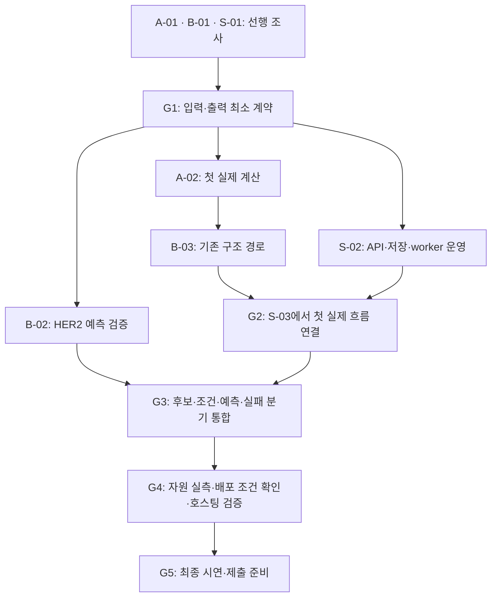

# Bio-3 MVP 실행 계획

작성일: 2026-09-25. 상태: 조사와 회의에 따라 조정하는 작업 계획 초안.

## 1. 계획의 기준

목표는 기존 후보 2–3개의 **입력 → 자료 확인 → 필요한 예측·분석 → 3D 비교 → 결과 보고**를 웹에서 끝까지 연결하는 것이다. 신규 항체 생성은 [PRD의 MVP 이후 고려 사항](PRD.md#10-mvp-이후-고려-사항)에 두며 이번 작업의 선행 조건으로 삼지 않는다.

사용자 확인 사항: 로직 2명·서비스 1명으로 진행하며, 날짜와 예상 소요 시간 대신 **선행 작업·인계 산출물·완료 조건**으로 계획한다. 현재 별도로 진행한 로직 구현·실제 NVIDIA API 호출·선정 입력 파일과 로직 담당의 희망 분담은 없다. 아래 A/B는 실제 개인에게 확정한 역할이 아닌 제안이다.

| 기준 문서 | 이 계획에서 사용하는 내용 |
|---|---|
| [INTENT](intent/INTENT.md) | 사용자 문제, 기능 목적과 해석 경계 |
| [PRD](PRD.md) | F01–F10 요구사항, Q01–Q06 미결정 항목, 완료 조건 |
| [ARCHITECTURE](ARCHITECTURE.md) | 구성요소·상태·데이터·연동 계약 초안 |
| [ADR](ADR.md) | 기술 선택·잠정 AWS 배치안과 검증 조건 |
| [HER2 검증 기준](topics/her2/validation.md) | 공개 구조 검증과 실제 예측 호출의 구분 |

계획의 작업 순서·담당 제안은 설계 판단이며 실행 완료 사실이 아니다. 이 문서 작성에서는 공식 기술 자료를 조사했으며, 패키지 설치·분석 실행·유료 API 호출·AWS 자원 생성은 수행하지 않았다. 아래 구현 작업의 초기 상태는 모두 미착수다.

2026-09-25 후속 [서비스 조사](frontend-hosting/overview.md)에서 누구나 서비스 이용, PC 중심, 예제와 직접 입력·업로드, 공개 자료만 허용, 본인 임시 결과 방식과 조건부 호스팅 종료 기준을 확인했다. Q01–Q03의 남은 세부 항목은 PRD의 현재 상태를 따른다. S-01의 소비 요구 조사는 작성됐지만 Mol*·Docker 실행 실험은 아직 없으며 S-01 전체 완료로 처리하지 않는다. 모델 제공 경로·이용 조건의 새 확인 사항은 [호스팅 조사](frontend-hosting/hosting-requirements.md)를 함께 검토한다.

후속 사용자 요청으로 [임시 계약 v0.1.0](frontend-hosting/temporary-contract.md)과 모의 시나리오를 먼저 마련했다. 서비스 화면·mock API·worker 운영·Docker 작업은 이 기준으로 시작하고 실제 로직은 adapter에서 맞춘다. 아래 G1은 실제 로직과의 인계·통합 기준이며, 임시 계약을 사용하는 독립 서비스 개발을 기다리게 하는 조건으로 적용하지 않는다.

## 2. 이번 조사에서 확인한 의존성

확인일: 2026-09-25. 문서상 기능과 이 프로젝트에서의 실행 성공을 구분한다.

| 영역 | 확인한 내용과 출처 | 계획에 반영할 일 |
|---|---|---|
| 로직 A: 구조 확보 | RCSB는 구조 검색과 메타데이터 조회 API를 구분하며, assembly·사슬·당쇄 등도 별도 개체로 다룬다. [RCSB API](https://www.rcsb.org/docs/programmatic-access/web-apis-overview) | PDB ID만 정하지 말고 사용할 구조 파일·assembly·후보 대응·출처를 함께 인계한다. |
| 로직 A: 잔기 대응 | Biopython 파서는 author/label 번호 선택에 따라 해석이 달라지며, label 번호가 없는 비고분자 잔기가 생략될 수 있다. [MMCIFParser](https://biopython.org/docs/1.88/api/Bio.PDB.MMCIFParser.html) | 사슬·잔기 대응과 비단백질 원자 보존을 먼저 검증한다. 출력 숫자를 3D 잔기 번호로 그대로 쓰지 않는다. |
| 로직 A: 당쇄·표면 | FreeSASA의 PDB 입력 기본 옵션은 HETATM을 제외한다. [FreeSASA Structure](https://freesasa.github.io/python/classes.html) | 당쇄 포함 여부·원자 반지름·미지원 원자 처리와 입력 변환을 검증한 뒤 표면 노출 비교를 제공한다. 파일에 당쇄가 있다고 계산에도 포함됐다고 보지 않는다. |
| 로직 B: 외부 예측 | NVIDIA의 Boltz-2 참고 규격은 `polymers` 요청과 `structures`의 mmCIF 문자열, `confidence_scores`, `metrics` 응답을 설명한다. [NVIDIA API 참고자료](https://github.com/NVIDIA-BioNeMo/bionemo-agent-toolkit/blob/main/nim-skills/boltz2-nim/references/api.md) | 실제 계정 응답을 보존하고 서비스용 결과로 변환한다. 반환되지 않은 ipTM·PAE 등의 지표를 있다고 가정하지 않는다. |
| 로직 B: 함수 연결 | NAT는 함수의 입력·출력 스키마를 지정할 수 있지만 출력 스키마 설명만으로 결과의 유효성이 모두 검증되는 것은 아니다. [NAT 함수 문서](https://docs.nvidia.com/nemo/agent-toolkit/latest/extend/custom-components/custom-functions/functions.html) | A의 계산 함수를 구조화된 계약으로 연결하고 B가 결과 검증·근거 연결을 구현한다. |
| 서비스: 파일 접수 | 파일과 form을 함께 받는 요청은 multipart이며 별도 JSON body를 같은 방식으로 선언할 수 없다. [FastAPI 파일·form](https://fastapi.tiangolo.com/tutorial/request-forms-and-files/) | 메타데이터를 form 필드로 보낼지 업로드와 입력 접수를 분리할지 초기 계약 회의에서 결정한다. |
| 서비스: 3D 연결 | Mol*는 사슬·잔기 선택과 선택 이벤트를 지원한다. [Mol* selections](https://molstar.org/docs/plugin/selections/) | A가 제공한 대응표로 표 → 3D 강조를 작은 실험으로 먼저 확인한다. |
| 서비스: Docker·호스팅 | Compose의 컨테이너 시작은 애플리케이션 준비 완료를 뜻하지 않는다. EC2 중지·재시작 시 공인 IPv4가 바뀔 수 있다. [Compose 준비 상태](https://docs.docker.com/compose/how-tos/startup-order/), [EC2 중지·시작](https://docs.aws.amazon.com/AWSEC2/latest/UserGuide/Stop_Start.html) | DB 준비 확인·마이그레이션·worker 시작 순서와 도메인·TLS·재기동을 배포 검증에 포함한다. |

라이브러리 버전 표기는 조사한 문서의 버전이며 설치 버전 확정이 아니다. 외부 API의 동기·비동기 응답, 요청 ID·조회 경로, 실제 한도·소요 시간은 B-01/B-02에서 확인한다. 다른 NVIDIA 모델의 상태 조회 규격을 Boltz-2에 그대로 적용하지 않는다.

## 3. 역할 분담 제안

| 역할 | 주 책임 | 다른 역할에 인계할 것 |
|---|---|---|
| 로직 A — 자료·구조 분석 | 후보와 원자료 선정, 서열·사슬·잔기 대응, 구조 조건별 계산, 과학적 기대값·해석 범위 검토 | 재현 가능한 입력 묶음, 계산 함수, 대응표·구조 파일, 지표 정의·단위·누락 사유·검증 근거 |
| 로직 B — 예측·에이전트 흐름 | NVIDIA 호출·응답 변환, NAT 함수 연결, 예측 생략·보류·실패 분기, 근거 기반 의견·결과 조립 | 분석 실행 진입점, 단계별 진행·오류, 결과 스냅샷·JSON/CSV, 의존성·실행 조건·호출 기록 |
| 서비스 — 화면·API·호스팅 | React·Mol* 화면, FastAPI 접수·조회, DB·파일 저장, worker 프로세스 운영, Docker·AWS 배포 | 화면·API 계약, 작업 실행·복구·접근 제어, 공통 실행 환경, 배포·복구·운영 절차 |

**worker의 경계:** B는 “검증된 입력을 받아 분석하고 단계·결과를 반환하는 실행부”를, 서비스는 “작업을 저장·점유하고 B의 실행부를 호출하며 상태·파일을 보존하는 운영부”를 맡는다. A의 계산 함수가 웹 API나 작업 DB를 직접 제어하지 않게 한다. DB 상태를 두 역할이 각각 구현하지 않도록 G1에서 경계를 맞춘다.

분담은 실명·숙련도·작업 속도를 추측한 배정이 아니다. 병목이나 조사 결과에 따라 작업 단위로 옮길 수 있으며, 옮길 때 인계 산출물과 검토 책임도 함께 변경한다.

## 4. 먼저 맞출 입력·출력과 인계 규칙

로직 전체가 완성될 때까지 서비스를 기다리게 하지 않는다. **실제 자료를 읽는 첫 조사 → 최소 계약과 예시 합의 → 각 영역 병행 구현 → 실제 결과로 통합 검증** 순서로 진행한다. 아래는 합의할 항목이며 현재 존재하는 파일·확정 JSON 스키마가 아니다.

| 인계 ID | 생산 → 소비 | 합의·전달할 내용 | 받은 쪽의 확인 |
|---|---|---|---|
| D1 입력 묶음 | A → B·서비스 | HER2·후보 2–3개 식별, 중쇄·경쇄·분석 구간, FASTA·선택 구조 파일, 출처·해시, 필수/선택 구분 | 동일 입력을 재사용할 수 있고 후보·파일·구간 대응이 모호하지 않은가 |
| D2 구조·분석 결과 | A → B·서비스 | 원본/분석용 mmCIF, 사슬·잔기 대응, 좌표 단위·정렬 기준·변환 적용 여부, 접촉·충돌·표면 등 지표와 누락 이유 | 표의 근거가 같은 구조의 잔기를 가리키고 정렬이 중복 적용되지 않는가 |
| D3 예측 결과 | B → A | 요청 설정·원본 응답, 반환된 구조별 ID·신뢰도·실제 제공 지표, 사슬·입력 대응, 호출 상태·시간 | 반환 구조가 입력 후보·분석 구간과 맞으며 A의 계산 함수가 읽을 수 있는가 |
| D4 실행 계약 | B ↔ 서비스 | 입력 참조와 설정을 받는 진입점, 진행 이벤트·오류 유형·종료 의미, 파일 인계 방법, 재시작·중복 호출 책임 | HTTP 요청과 분리해 실행하고 브라우저 재접속·worker 중단을 구분할 수 있는가 |
| D5 결과 계약 | B → 서비스, A 검토 | schema version, 실행·후보·조건·근거 ID, 값·단위·출처, 검토 의견·후속 질문, 구조·JSON·CSV 산출물 참조 | 화면·보고서·다운로드가 같은 결과이며 미확인과 0이 구분되는가 |
| D6 배포 인계 | A·B → 서비스 | Python·라이브러리·시스템 의존성, 실행 명령, 환경변수 이름, 외부 통신 대상, 캐시·작업 디렉터리·권한, CPU/GPU 요구, 측정 시간·최대 메모리·파일 용량 | 동일 Docker 환경에서 실행·저장·재시작이 가능하고 호스트 비용·규격을 산정할 수 있는가 |

G1에서 D1–D5의 최소 버전과 D6의 초기 실행 조건을 합의하고, 실제 예측·통합 결과로 갱신한다. 구체적인 저장 경로·스키마 파일명·함수명은 합의 시 정한다. 외부 API 응답을 서비스 응답으로 그대로 노출하지 않는다.

공통 예시는 정상·판단 보류·실행 오류를 포함한다. 실제 파일·분석 결과와 UI 개발용 모의 응답을 표시로 구분하며, 아직 계산하지 않은 값을 그럴듯한 수치로 채우지 않는다. 생산자와 소비자가 같은 예시를 파싱·표시하는 것으로 인계를 확인한다. 계약을 변경하면 버전·영향 작업·관련 예시를 함께 갱신한다.

## 5. 로직 A 계획 — 자료와 구조 분석

| 작업 | 선행 조건 | 수행 내용·산출물 | 완료 조건·인계 |
|---|---|---|---|
| A-01 기준 입력 조사 | 기존 HER2 문서 | 1N8Z·1S78의 실제 파일·주석을 확인하고 후보·항체 형식·HER2 구간·assembly·사슬·번호·누락을 대조; 당쇄·주변 구조 자료 확보 가능성 확인; D1과 D2의 기본 대응표 작성 | ID만 제시하지 않고 원자료·대응 근거가 있는 입력 묶음을 B·서비스에 전달. 두 구조를 최종 후보로 자동 확정하지 않고 PRD Q04를 공동 검토 |
| A-02 계산 기준과 첫 결과 | A-01, G1의 D2 최소 계약 | 접촉·충돌·표면 노출·정렬의 정의·단위·필요 원자·제외 규칙·판정 근거 조사; 계산 함수와 공개 구조 첫 결과 작성 | 원자료에서 독립적으로 정한 기대값과 대조. 합의 전 임계값으로 후보 의견을 확정하지 않음. 첫 실제 D2를 B·서비스에 인계 |
| A-03 구조 조건·예측 결과 확장 | A-02, 예측 구조 검증에는 B-02의 D3 | 같은 후보의 중심 구조/확보한 주변 구조 포함 조건 비교; 당쇄 원자·미지원 원자·누락 처리 검증; 예측 간 자세 일관성 분석 | 조건별 구성요소·지표·정보 공백을 구분. 당쇄 자료가 없는 사례의 보류와 자료가 있는 사례의 실제 비교를 각각 검증 |
| A-04 과학적 결과 검수 | A-03, B-03, S-03 | 정상·불일치·자료 누락·지표 충돌에서 표·강조 잔기·의견·보고서를 대조; D6의 분석 자원 사용 측정 | PRD F02·F05·F06·F08의 근거 확인. 계산 신뢰도와 결합력·효능이 혼동되지 않으며 미검증 항목을 기록 |

당쇄를 포함한 실제 비교 입력을 확보하지 못하면 보류 분기는 구현할 수 있지만 **PRD F06의 실제 조건 비교까지 검증했다고 표시하지 않는다**. 필요한 자료를 보완하거나 범위 변경을 논의할 항목으로 남긴다.

## 6. 로직 B 계획 — 외부 예측과 에이전트 흐름

2026-09-27 사용자 요청에 따른 현재 상태 정리: 초기 B-02의 MSA 준비 경로는 당시 가정이다. 현재는 별도 MSA 없이 Boltz-2를 호출하며, 필요성과 개선을 통제된 추가 비교에서 확인한 뒤 연결을 검토한다. 계획의 작업 순서·담당·완료 여부는 이번 정리로 바꾸지 않는다.

| 작업 | 선행 조건 | 수행 내용·산출물 | 완료 조건·인계 |
|---|---|---|---|
| B-01 계정·응답·실행 조건 조사 | 기존 모델·도구 문서; 실제 호출에는 사용 가능한 계정·키 | Nemotron·NAT의 최소 함수 호출, Boltz-2 공식 소형 입력의 호출 가능 여부 확인; endpoint·버전·설정·요청/응답·필드·오류·시간 기록; D3–D6 초안 작성 | 설치 안내만 읽은 상태와 실제 호출 성공을 구분. 비밀키를 제외한 응답 예시·의존성·실행 방법 인계. 소형 입력 성공을 HER2 성공으로 간주하지 않음 |
| B-02 실제 HER2 예측 연결 | A-01, B-01, G1 | D1을 실제 요청으로 변환하고 표적/항체 사슬 조합 확인 (MSA 현재 미연결·기본 실행 제외, 추가 검증 후 도입 검토); HER2 복합체 예측 한 건과 반환 구조 검증; 요청·응답 대응 보존 | A가 반환 구조를 읽고 입력과 대응 확인. 반환되지 않은 지표는 미확인 처리. 실제 소요 시간·파일 크기·실행 한도를 D6에 반영 |
| B-03 판단 흐름과 보고 조립 | G1, A-02; 예측 분기에는 B-02 | A의 함수를 NAT에 연결; 기존 구조 활용·예측 필요·입력 정정·판단 보류 분기 구현; 구조화된 근거 검증 후 의견·후속 질문·JSON/CSV 생성 | 먼저 기존 구조 경로를 서비스와 연결하고, 이후 예측 경로 추가. D4·D5에 맞는 실제 결과와 근거별 추적 가능성 확인 |
| B-04 장애·한도·재현성 검증 | B-02·B-03, S-02·S-03 | 실패·timeout·중단·부분 결과·설명 생성 실패를 구분; 확인되지 않은 외부 호출 재전송 방지; 함수·LLM 출력과 근거 ID 검증; D6 확정 가능한 부분 인계 | PRD F03·F04·F08–F10을 실제 실행과 명시한 합성 장애로 확인. 실행 로그·설정·결과를 재검토 가능하게 보존 |

계정 접근이 막히면 원인·허용되는 대안·예상 영향부터 기록한다. 합의된 모의 응답으로 서비스 개발은 이어갈 수 있으나 실제 예측 완료로 대체하지 않는다. 공개 구조로 예측을 생략하는 사례와, 새 예측이 필요한 사례를 별도로 준비한다. 단순 도구 나열 대신 자료 상태에 따라 실행·생략·보류가 달라지는지 확인한다.

## 7. 서비스 계획 — 화면·API·호스팅

서비스 담당은 아래 작업을 한 사람이 순서대로 진행하는 기준이다. 화면·API·배포를 동시에 완성하는 일정으로 잡지 않는다.

| 작업 | 선행 조건 | 수행 내용·산출물 | 완료 조건·인계 |
|---|---|---|---|
| S-01 화면·실행 환경 조사 | 기존 PRD·ARCHITECTURE | React·Mol*의 대표 공개 구조 로딩 실험, 업로드 방식·결과 URL·진행 표시 검토, FastAPI·DB·Docker 최소 환경과 AWS 확인 목록 정리 | G1에 D1–D5의 소비 요구를 제시. A-01 파일을 받으면 표 → 실제 잔기 강조 확인. 사전 실험용 구조를 최종 분석 입력으로 단정하지 않음 |
| S-02 API·저장·worker 운영부 | G1, D6 초기 조건; 공개 설정에는 Q01–Q03 | 입력·실행·상태·결과·파일 API, DB·파일 저장, 작업 점유·중복 접수·재접속 구현; D4의 B 실행부를 호출하는 운영부 작성 | 합의된 모의 응답으로 계약 검증 후 실제 B 실행부 연결. 원본 입력·실행 ID·파일 참조가 컨테이너 밖 영속 저장에 유지 |
| S-03 첫 실제 흐름과 전체 화면 | S-02, A-02, B-03의 기존 구조 경로 | 먼저 입력 1건 → 실제 분석 → 3D·표·다운로드 연결; 이후 후보 2–3개·구조 조건 전환·진행·보류·오류·결과 보고 완성 | 첫 1건은 연결 검증일 뿐 MVP 완료가 아님. PRD F01·F04·F07·F09·F10의 화면·결과 버전·재접속 일치 확인 |
| S-04 Docker 통합과 AWS 배포 | 로컬 실제 흐름, D6 측정 결과, Q01–Q03·Q06의 배포 관련 결정 | 의존성·런타임 버전 고정, DB 준비·마이그레이션·worker 시작 순서 검증; CPU·메모리·디스크·통신·API 비용을 바탕으로 호스트 선택; HTTPS·접근 제어·백업·복구 검증 | 실제 호스트에서 입력부터 결과까지 실행. 컨테이너 교체·재기동·파일 복구 후 같은 결과를 조회. 보안·비용·성능의 미확인 부분 명시 |
| S-05 시연·제출·운영 종료 준비 | G4, A-04·B-04의 검증 기록 | A·B와 정상·보류·실패 시연 동선 확인; 실행 안내·NVIDIA 사용 지점·제출물 준비; 결과 보관·자원 정리 계획 | 외부 열람자가 정해진 접근 방식으로 결과를 확인. 실시간 실행과 이전 실행 기록을 구분. 대회 최신 제출 조건 확인 후 최종 점검 |

**호스팅 선행 조건:** S-01의 구성 조사와 로컬 Docker 뼈대는 로직 완성 전에 진행할 수 있다. 다만 D1/D5 없이 업로드·결과 저장 규격을 확정하거나 D6 없이 EC2 규격·timeout·저장 용량을 최종 확정하지 않는다. 4 vCPU·16 GiB는 [현재 검증 후보](ARCHITECTURE.md#8-docker와-aws-배치안)이며 측정된 요구량이 아니다.

## 8. 합류 시점과 다음 단계 진입 조건

각 G는 회의 날짜가 아니라 산출물을 함께 확인하는 합류 지점이다. 영역 전체가 끝날 때까지 기다리지 않고 필요한 산출물이 나오면 해당 작업을 시작한다.

| 합류 지점 | 확인할 산출물 | 통과 조건 | 미충족 시 계속할 수 있는 일 |
|---|---|---|---|
| G1 최소 계약 | A-01 입력·대응표, B-01 응답 조사, S-01 소비 요구, D1–D5 예시·D6 초안 | 생산자·소비자가 정상·보류·오류 예시를 함께 읽음. 미실행 값·임시 필드를 표시하고 필수/선택·타입·식별자·상태 의미 합의 | 후보 조사·계정 확인·UI 실험 계속. 외부 호출 미검증이면 provider 연결 관련 계약은 잠정 상태로 명시 |
| G2 첫 실제 연결 | A-02 → B-03 → S-02/S-03의 공개 구조 경로 | 실제 입력·계산·구조 파일이 화면과 다운로드까지 연결되고 같은 후보·실행을 가리킴 | B-02 예측 조사 병행. G2만으로 실제 예측이나 전체 MVP 완료를 주장하지 않음 |
| G3 전체 기능 통합 | A-03·B-02/B-03/B-04·S-03, PRD F01–F10 대조 | 후보 2–3개, 구조 조건, 실제 예측·생략, 보류·충돌·오류·부분 결과가 구분됨. 과학적 기준 Q04–Q05 검토 | 실패한 경로만 보완. 구현되지 않은 기능을 mock으로 바꿔 통과 처리하지 않음 |
| G4 배포 검증 | A-04·B-04·S-04, D6 실측, Q01–Q03·Q06 결정 | 실제 호스트에서 접근·전체 흐름·재시작·저장·복구 검증. 규격·실행 한도·가동 범위와 비용 산정 기록 | 배포 조건이 미정이면 로컬 통합·측정·제출 자료 초안 준비. AWS 구축 완료로 표시하지 않음 |
| G5 시연 준비 | S-05, 공통 시나리오·증거·제출 조건 | 다른 담당자가 실행 안내를 따라 시연하고 정상·판단 보류·실행 실패를 구분할 수 있음 | 부족한 증거·접근 안내·재현 절차 보완 |

최초 연결의 의존 경로는 **A-01 → G1 → A-02 → B-03 → S-03**이며 S-02가 함께 필요하다. 최종 완료에는 **B-02의 실제 HER2 예측, A-03의 조건 비교, 배포 관련 결정과 S-04**도 필요하다. 생성 기능을 추가해 이 경로를 늘리지 않는다.

## 9. 공동 검증과 회의에서 정할 항목

### 기능별 검토 책임

| PRD 범위 | 주 검토 | 함께 확인할 증거 |
|---|---|---|
| F01 입력, F02 대응 | 서비스 + A | 원본 입력·에러 위치·사슬/번호 대응·새 실행 구분 |
| F03 분석 선택, F04 진행 | B + 서비스 | 실제 호출/생략 기록, 저장된 상태, 새로고침·중단 처리 |
| F05 구조 검토, F06 조건 비교 | A + B | 계산 정의·독립 기대값·당쇄 포함 여부·누락과 조건별 결과 |
| F07 3D 연결 | 서비스 + A | 동일 구조·후보·조건·잔기, 정렬 기준, 누락 위치 표시 |
| F08 의견, F09 보고, F10 부분·실패 | B + A + 서비스 | 근거와 의견의 범위, 파일·화면 일치, 후보별 오류·부분 결과 |

정상 입력, 서열/사슬 불일치, 당쇄·주변 구조 누락, 예측 간 불일치, 외부 API 실패, worker 중단을 공통 검증 묶음으로 둔다. 정상·과학적 기대값은 원자료에 근거하고 장애 주입·합성 입력은 별도 표시한다. 실제 효과·신규 후보 정확도는 데모 동작 검증과 구분한다.

### 남은 결정

| 항목 | 누가 근거를 준비하는가 | 언제 결정해야 하는가 |
|---|---|---|
| A/B 실제 분담과 작업 이동 | 참여자 전원, 이 문서의 역할·산출물 표 검토 | 해당 작업 착수 전; 이후 병목에 따라 조정 |
| Q01 접근 대상, Q03 허용 데이터·보관/삭제 | 서비스가 대안·영향 정리, 사용자 확인 | 인증·데이터 저장·외부 전송 정책 구현 전. 답변을 기다리는 동안 공개 자료 조사 가능 |
| Q02 총예산·가동 범위·계정·도메인 | 서비스가 D6 기반 비용안 준비, 사용자 확인 | 실제 자원 생성 전. 해커톤 기간만 운영한다는 원칙은 유지 |
| Q04 후보·형식·분석 구간 | A가 실제 자료 대조, B가 예측 가능 범위 확인 | G1 입력 기준 합의; 변경 시 영향받는 입력·결과 예시 갱신 |
| Q05 지표 정의·임계값·의견 규칙 | A 조사, B 교차 검토 | A-02/B-03의 해당 판정 구현 전. 근거 부족이면 사용자에게 범위·대안 설명 후 확인 |
| Q06 계정·모델·한도·시간·조건 | B 실측, 서비스 비용·배포 영향 검토 | 예측 통합과 G4 전. 호출 가능 여부와 이용·제출 조건은 별도 확인 |
| 최신 대회 제출 방식·필수 NVIDIA 사용 | 서비스가 공식 안내 수집, 전원이 실제 사용 기록 대조 | 제출 준비 초기에 확인하고 G5 직전 재확인 |

대회 관련 확인은 [요구사항](hackathon/requirements.md)과 [신청 폼 기록](hackathon/application-form.md)에서 출발하되 당시 기록을 현재 규정 확정으로 간주하지 않는다. 최초 계획 인터뷰는 날짜 없는 계획 방식과 별도 진행 작업·분담이 없다는 사실을 확인했다. 이후 서비스 인터뷰에서 정한 Q01–Q03의 방향과 남은 항목은 [현재 PRD](PRD.md)·[인터뷰 기록](frontend-hosting/overview.md)을 따르며 Q04–Q06은 해결된 것으로 처리하지 않는다.

## 10. 계획 변경과 진행 기록

각 작업에는 착수 후 **상태(미착수/진행/확인 대기/완료), 산출물 위치, 실제 검증 결과, 다음 소비자, 남은 질문**을 기록한다. 완료는 작성자의 설명만으로 표시하지 않고 해당 인계 조건으로 확인한다.

계약·과학적 기준·배포 방식을 바꾸면 영향을 받는 작업 ID와 PRD·ARCHITECTURE·ADR을 함께 검토한다. 조사에서 API 접근 불가·필수 자료 부족·비용 초과가 확인되면 이유와 가능한 대안을 제시하고 범위를 조정하며, 조정 전 요구사항을 몰래 삭제하지 않는다. 새 기능보다 막힌 필수 경로와 검증을 먼저 해결한다.

해커톤 이후 자원 정리는 산출물 인계·보관 정책 확인 후 수행할 운영 작업으로 남긴다. 이 계획 작성은 구현·배포·커밋·push 또는 자원 삭제를 실행한 기록이 아니다.
