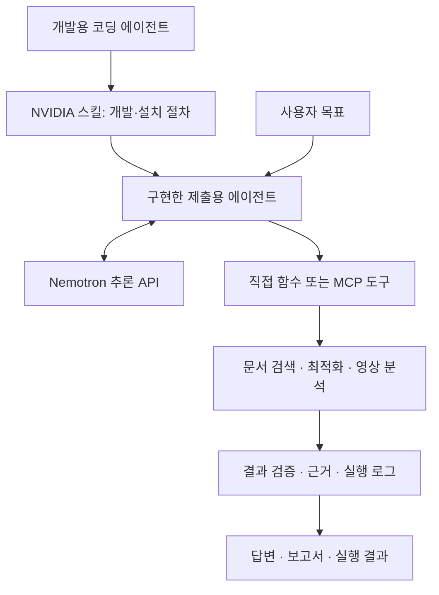

# 스킬·에이전트·모델·도구의 관계

> 이전 기록: `nvidia/docs/02-stack-map.md`에서 2026-09-24 이관. 아래 조사·작성 기준일을 유지하며 이번 이관에서 외부 사실이나 실행 결과를 재검증하지 않았습니다.

기준일: 2026-09-22. 아래 구조는 공식 제품 역할을 종합한 설계 설명이며 대회 지정 아키텍처는 아니다.

## 역할 구분

| 구성 | 하는 일 | 대표 예 | 이것만으로 부족한 것 |
|---|---|---|---|
| 개발용 에이전트 | 코드를 작성하고 설치·검증을 수행 | Codex, Claude Code 등 | 제출용 서비스의 지속 실행 |
| Agent Skill | 특정 제품의 절차·참조·스크립트를 전달 | `aiq-deploy`, `cuopt-routing-api-python` | 모델·서비스·GPU 자체 |
| 제출용 에이전트 | 사용자 목표에 따라 도구를 선택하고 결과를 처리 | 직접 만든 NAT 워크플로, AI-Q 기반 앱 | 실제 업무 데이터·도구 연결 |
| 모델 | 해석·추론·도구 호출 인자·답변 생성 | Nemotron, Cosmos, Speech 모델 | 도구를 실행하는 프로그램 |
| 추론 서비스 | 모델을 API로 제공 | 호스팅 NIM API, 자체 NIM | 업무 로직과 사용자 화면 |
| 도구 | 검색·계산·파일 처리·DB 조회 등 실행 | Retriever, cuOpt, Python 함수 | 언제 무엇을 호출할지 판단 |
| MCP | 도구를 에이전트에 연결하는 표준 인터페이스 | Retriever MCP, AI-Q MCP | 데이터 접근 권한·서비스 배포 |
| Blueprint | 여러 구성요소를 조립한 참조 구현 | AI-Q, RAG, VSS | 우리 데이터·평가지표에 맞춘 완성 |
| 런타임 통제 | 파일·네트워크·프로세스 실행 제한 | OpenShell, NemoClaw | 업무 결과의 정확성 보장 |
| 하드웨어 | 모델·연산·영상 처리 실행 | L40S, DGX Spark | 에이전트의 목표·설계 |

근거: [Skills](https://github.com/NVIDIA/skills), [NAT](https://github.com/NVIDIA/NeMo-Agent-Toolkit), [NIM](https://docs.api.nvidia.com/nim/docs/overview), [OpenShell](https://github.com/NVIDIA/OpenShell).

## 연결 예시

스킬을 개발용 에이전트에만 설치해도 NVIDIA 제품 사용 코드를 만드는 데 도움이 된다.
제출용 에이전트가 스킬 자체를 읽고 실행하게 만들 수도 있지만, 그 경우 스킬 로더·실행 권한·도구 환경을 별도로 구성해야 한다.
주요 업무 로직을 Python 함수로 구현해 모델의 tool calling에 연결하는 방식도 가능하다.

## 실제 실행은 이렇게 일어난다 — 설계 예시

1. 사용자가 목표와 제약조건을 입력한다.
2. 모델이 부족한 정보를 확인하거나 사용할 도구와 인자를 선택한다.
3. 애플리케이션이 인자 형식을 검증하고 실제 도구를 실행한다.
4. 도구가 반환한 근거·계산값·오류를 모델에 전달한다.
5. 에이전트가 추가 작업 여부를 판단하고, 조건을 충족하면 결과를 확정한다.

모델이 “파일을 만들었다”라고 말하는 것과 파일 생성 도구가 성공한 것은 다르다.
실행 결과·반환값·산출물을 확인할 수 있어야 한다.

## 혼동하기 쉬운 이름

- **Nemotron**: 모델 계열. **NeMo**: 학습·검색·평가·에이전트 등 여러 도구를 포함하는 제품군.
- **NemoClaw**: 지원 에이전트를 OpenShell에서 실행하도록 묶은 참조 스택. **OpenClaw** 자체는 별도 프로젝트다.
- **OpenShell**: 실행 환경의 경계를 관리한다. **Guardrails**는 대화·입출력·도구 동작의 애플리케이션 규칙을 다룬다.
- **NVIDIA/skills**: 설치형 Agent Skills 카탈로그. **NVIDIA-NeMo/Skills**는 LLM 합성 데이터·훈련·평가 파이프라인 프로젝트다. [NeMo Skills](https://github.com/NVIDIA-NeMo/Skills)
- **NVIDIA Build에 있는 모델**과 **NVIDIA가 개발한 모델**은 다르다. 카탈로그에는 다른 회사의 모델도 포함된다. [Build](https://build.nvidia.com/explore/discover)
